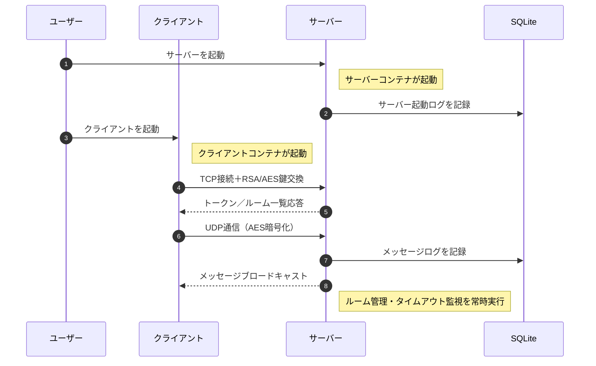
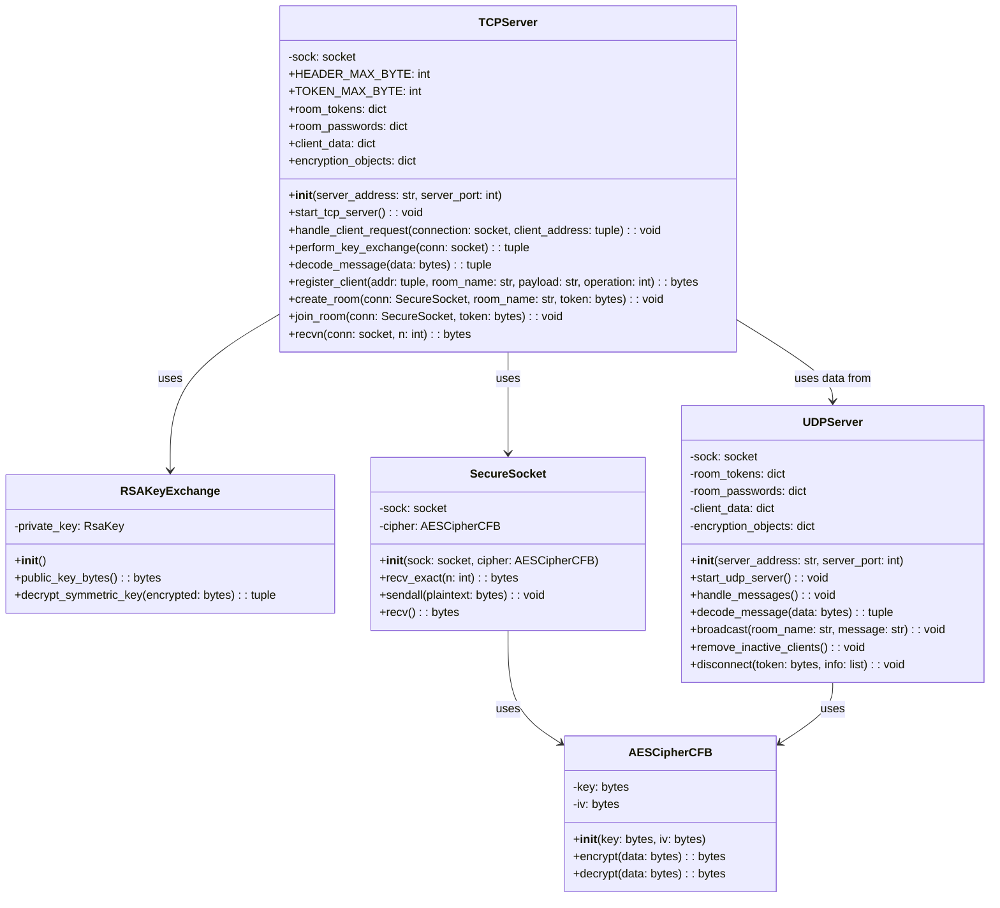

# Online Chat Service 


 


[](./LICENSE)


<br>

### ゼロから構築したグループチャットアプリ

### 暗号通信 + 独自プロトコル + CI/CDパイプライン を自作

<br>

## ⭐ デモ画像

<br>

### チャットルーム作成と会話の流れを確認できるデモ画像

<br>

|  |  |
|:--:|:--:|
|  |  |

<br>


## **📝 サービス紹介と導入ガイド**


- [サービスの特徴・開発の目的](#サービスの特徴・開発の目的)

- [セットアップ手順](#セットアップ手順)

- [基本的な使い方](#基本的な使い方)

<br>

## **🛠️ 技術構成**


- [システム全体の構成図](#システム全体の構成図)

- [並列化とクラス設計](#クラス構成とモジュール設計)

- [CI/CDの概要](#ci)

- [使用技術](#使用技術)


<br>

## **💡 開発の振り返りと展望**


- [設計上のこだわり](#設計上のこだわり)

- [苦労した点](#苦労した点)

- [クラウド化・大規模化へのアプローチ](#追加予定の機能)

<br>

## **📚 出典・ライセンス**


- [参考文献](#参考文献)

- [ライセンス情報](#ライセンス情報)

<br>

---

## <a id="サービスの特徴・開発の目的"></a> 📝 サービスの特徴・開発の目的

<br>

###  サービスの全体像

- このプロジェクトは、**グループチャットができるサービス**です。

- ホストユーザがチャットルームを作成し、ゲストユーザが入室することでグループチャットができます。


<br>

###  できること

<div style="height:8px;"></div>

- **ルーム作成・参加**  

  ホストが新規ルームを作成、ゲストは既存ルームに参加

- **同時接続**
  
  マルチスレッドによって、複数のルームで複数のユーザが同時にチャット可能

- **自動退出**  

  5分間操作がないユーザーは自動的にルームから退出


<br>


###  作成のきっかけ

<div style="height:8px;"></div>

1. **課題意識**

     ライブラリに頼らずに、ネットワーク通信や暗号技術を自力で実装することで理解を深めるため

2. **解決アプローチ**

     `TCP/UDP通信`、`RSA＋AES暗号`、`独自プロトコル`、`マルチスレッド`によってチャット機能を自力で構築

3. **得られた学び**

      通信・暗号・並列処理を含むシステム設計と実装、Docker化、GitHub Actionsによるビルドテストの経験

<br>

---

## <a id="セットアップ手順"></a> 🚀 セットアップ手順

<br>

### 1. 前提条件

以下を事前にインストールしてください

- [Git](https://git-scm.com/)

- [Docker](https://docs.docker.com/get-docker/)


  
<br>

### 2. リポジトリのクローン

以下のコマンドをターミナルで実行します

```bash
git clone git@github.com:BackendExplorer/Online-Chat-Service.git
```
```bash
cd Online-Chat-Service
```

<br>

---

## <a id="基本的な使い方"></a>🧑‍💻 基本的な使い方

<br>

### 1. コンテナ起動

Docker Desktopを起動したら、ターミナルを開いて、以下のコマンドでコンテナを起動します。


```bash
docker-compose up
```

<br>


http://localhost:8501 でアクセス可能です。

以下のように複数のクライアントを起動することで、ユーザー同士がチャットのやり取りができます

<br>

| ホスト | ゲスト |
|:--:|:--:|
|  |  |

<br>

### 2. ユーザーの操作手順


<br>


### 3. ログの確認

<br>

docker-compose.ymlがあるフォルダで、以下のコマンドを実行するとログを表示できます

```bash
docker compose exec server sqlite3 /app/logs.db "SELECT * FROM logs;"
```

<br>

| 項目名       | 説明                                               |
|--------------|--------------------------------------------------|
| `id`         | ログの通し番号（自動で増分）                     |
| `timestamp`  | ログが記録された日時（自動で現在時刻が設定される）|
| `event_type` | イベントの種類（例：'login', 'message', 'join_room' など）|
| `username`   | イベントに関連するユーザー名（任意）             |
| `room_name`  | イベントが発生したルーム名（任意）               |
| `details`    | イベントの詳細情報（任意）                       |
| `client_ip`  | クライアントのIPアドレス（任意）                 |


<br>


<br>

---


<div style="font-size:120%; line-height:1.6;">
  
## <a id="システム全体の構成図"></a>⚙️ システム全体の構成図




<br>


---


## <a id="クラス構成とモジュール設計"></a>📌 並列化とクラス設計

<br>

### <a id="server.py のクラス図"></a> サーバプログラム のクラス図

<br>



<br>

### TCP と UDP の並列処理の設計

<br>

- **課題点**
  
  正確な通信（ルーム作成・参加など）で必要な `TCP通信` と、

  リアルタイム性が求められるチャット通信で必要な `UDP通信` を並列処理する必要がありました。

<br>

- **解決アプローチ**

  `TCPServer` と `UDPServer` をそれぞれ別スレッドで起動し、並列処理を実現。

  クライアント情報やルーム情報は `TCPServer` のクラス変数に集約し、

  `UDPServer` からも直接参照できるように設計。
 
<br>
    
- **得られた成果**
  
  TCP による確実なルーム管理と UDP による低遅延チャットを同時に両立。
   
  複数ルーム・複数ユーザーが同時接続しても、メッセージの遅延や不整合がなく、

  安定したチャット体験を提供。  

<br><br>


### スレッドの起動フロー

<br>

1. **Main Thread**

    接続管理用の `TCP Thread` と通信用の `UDP Thread` を起動します。

<br>

2. **TCP Thread**

    クライアントからの接続要求があるたびに、個別の `Client Thread` を生成します。

<br>

3. **UDP Thread**
   
    自身の起動と同時に、メッセージを扱う `Message Thread` と

    タイムアウトを監視する `Timeout Monitor Thread` を生成し、これらを常時稼働させます。

<br>

---

## 🔀 CI/CDの概要 <a id="ci"></a>

<br>


<br>

<br><br>

### GitHub Actions で **ビルド → 配布** を自動化しています

<br>

- **コンテナの起動テスト**

  コード変更をトリガーに自動でビルドと起動検証を実行します

<br>

- **Dockerイメージの自動プッシュ**

  ビルドしたイメージをDocker Hubへ自動的にプッシュ。

  クラウド化の際にAWS EC2などから最新イメージを即座に pull＆起動できる仕組みを構築しました。

  自動プッシュされたイメージは、[Docker Hubリポジトリ](https://hub.docker.com/repository/docker/tenshinnoji/secure-chat-server/general)で確認できます。

<br>

---
## <a id="使用技術"></a>🧰 使用技術

<br>

<table>
  <tr>
    <th>カテゴリ</th>
    <th>技術スタック</th>
  </tr>
  <tr>
    <td>開発言語</td>
    <td>Python</td>
  </tr>
  <tr>
    <td rowspan="3">通信・暗号</td>
    <td>TCP / UDPソケット</td>
  </tr>
  <tr>
    <td>独自プロトコル (TCRP)</td>
  </tr>
  <tr>
    <td>ハイブリッド暗号方式 (RSA + AES)</td>
  </tr>
  <tr>
    <td>並列処理</td>
    <td>マルチスレッド</td>
  </tr>
  <tr>
    <td>UIフレームワーク</td>
    <td>Streamlit</td>
  </tr>
    <tr>
    <td rowspan="3">インフラ・コンテナ</td>
    <td>Docker</td>
  </tr>
  <tr>
    <td>Docker Compose</td>
  </tr>
  <tr>
    <td>AWS EC2 (クラウド展開予定)</td>
  </tr>
  <tr>
    <td>CI/CD</td>
    <td>GitHub Actions</td>
  </tr>
  <tr>
    <td>バージョン管理</td>
    <td>Git / GitHub</td>
  </tr>
  <tr>
    <td>描画・ドキュメント</td>
    <td>Mermaid / LaTeX</td>
  </tr>
  <tr>
    <td>開発環境</td>
    <td>macOS / VSCode</td>
  </tr>
</table>

<br>

---


## <a id="設計上のこだわり"></a>🌟 設計上のこだわり

<br>

- **独自プロトコルの導入背景**

  TCP通信では、異なる種類のデータを送る際ときに、データの境界を明確に区別できなかったので、

  各データのデータサイズをヘッダに入れて、受信側がデータの中身を簡単に特定できるようにしました。

  これによって、パケットの解析処理が容易になり、拡張性も高まりました。

<br>


<br>

---

## <a id="苦労した点"></a> ⚠️ 苦労した点

<br>

### 安全なチャットメッセージ送受信のための暗号化通信の設計

<br>

- **課題点**
  
  チャットの通信内容の秘匿性と、メッセージ交換のリアルタイム性を両立させる必要がありました。<br>
  
  安全な公開鍵暗号（RSA）は低速で、高速な共通鍵暗号（AES）は安全な鍵共有が課題でした。

<br>

- **解決アプローチ**

  最初に RSA で公開鍵をサーバーからクライアントに送り、クライアント側でAES鍵を生成し、<br>

  それをRSAで暗号化してサーバーに送信。以降の通信はAESによる共通鍵暗号化通信に切り替えることで、<br>

  安全かつ効率的にチャットメッセージを送受信できるようにしました。

<br>
    
- **得られた成果**

  この設計により、安全な鍵交換と低遅延なリアルタイム通信を両立させることができました<br>

  結果として、ユーザーは安全かつ快適にチャットを利用できます。
  
<br>


---

## <a id="追加予定の機能"></a> 🔥 クラウド化・大規模化へのアプローチ

<br>

### クラウド化への方針

<br>

- **課題点**

  現状では、このサービスはローカルでしか動作せず、外部のユーザーは利用できません。

  また、機能追加のたびに手動でサーバーを更新する必要があるので、ミスが起きやすいです。
  
<br>

- **解決アプローチ**

  サーバーの実行環境をAWS EC2へ移行し、インターネットへ公開します。

  また、GitHub ActionsでCI/CDパイプラインを構築し、

  コードが更新されるとDockerイメージのビルドからEC2へのデプロイまでを完全自動化します。

<br>

- **得られる成果**

  デプロイを自動化することで、ヒューマンエラーがなくなり、サービスの信頼性が向上します。

  また、デプロイの手間が省けるので、開発効率も高まります。


  


<br><br>


### システムの大規模化にあたっては、以下の3段階でアクセス増加に備えます。

<br>

1. **垂直スケーリング**

    処理能力を高めるためにCPUの性能を上げたり、キャッシュを増やすためにメモリを追加し、

    より多くのデータを保存するためにストレージを増やします。

<br>

2. **水平スケーリング**

    垂直スケーリングにおける物理的なハードウェアの限界を突破するために、

    サーバの数を増やします。このとき、各サーバーをノードと呼びます。

<br>

3. **ロードバランサー**
  
    ユーザーからのすべての通信は、まずロードバランサーノードに集約され、

    そこから適切なサーバノードに自動振り分けされます。

<br>

---

## <a id="参考文献"></a>📗 参考文献

<br>

### 公式ドキュメント

- [Python socket - ソケット通信](https://docs.python.org/3/library/socket.html)

  TCP・UDP通信の基本構文と使い方を参照

- [Python threading - マルチスレッド](https://docs.python.org/3/library/threading.html)

  マルチスレッド処理（Thread の生成・開始・join）を実装するために参照

- [PyCryptodome — RSA](https://pycryptodome.readthedocs.io/en/latest/src/cipher/oaep.html)

  RSA公開鍵暗号の暗号化・復号化の仕組みを理解するために参照

- [PyCryptodome — AES](https://www.pycryptodome.org/)

  共通鍵暗号方式によるデータの暗号化のために参照

- [Streamlit](https://docs.streamlit.io/)

  GUIを迅速に実装するために参照
  
<br>

### 参考にしたサイト

- [今更ながらソケット通信に入門する（Pythonによる実装例付き）](https://qiita.com/t_katsumura/items/a83431671a41d9b6358f)

- [python マルチスレッド マルチプロセス](https://qiita.com/Jungle-King/items/1d332a91647a3d996b82)

- [暗号化アルゴリズムの基本と実装をPythonで詳解](https://qiita.com/Leapcell/items/946a00fa060119f67444)

- [みんなが欲しそうなDockerテンプレートまとめ](https://qiita.com/ryome/items/ab23eeadf3c2ff6b35bd)

<br>

---

## <a id="ライセンス情報"></a>📜 ライセンス情報

<br>

<ul>
  <li>
    本プロジェクトの全コード・構成・図・UIなどの著作権は、制作者である Tenshin Noji に帰属します。<br><br>
    採用選考や個人的な学習を目的とした閲覧・参照は歓迎しますが、<br><br>
    無断転載・複製・商用利用・二次配布は禁止とさせていただきます。<br><br>
    ライセンス全文はリポジトリ内の <a href="./LICENSE.md" target="_blank">LICENSEファイル</a>をご覧ください。
  </li>
</ul>

<br>
