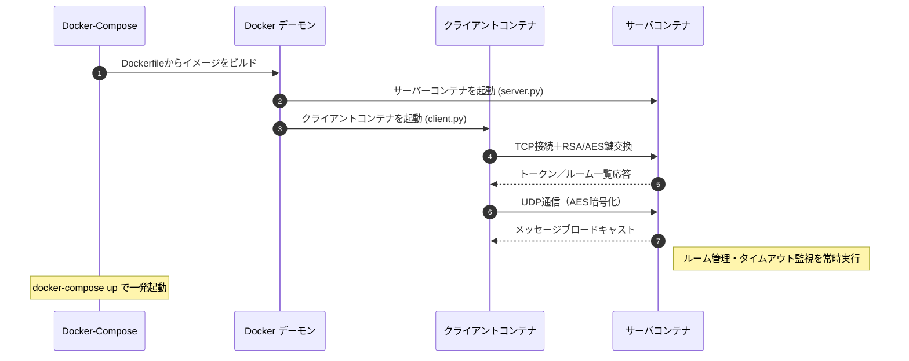
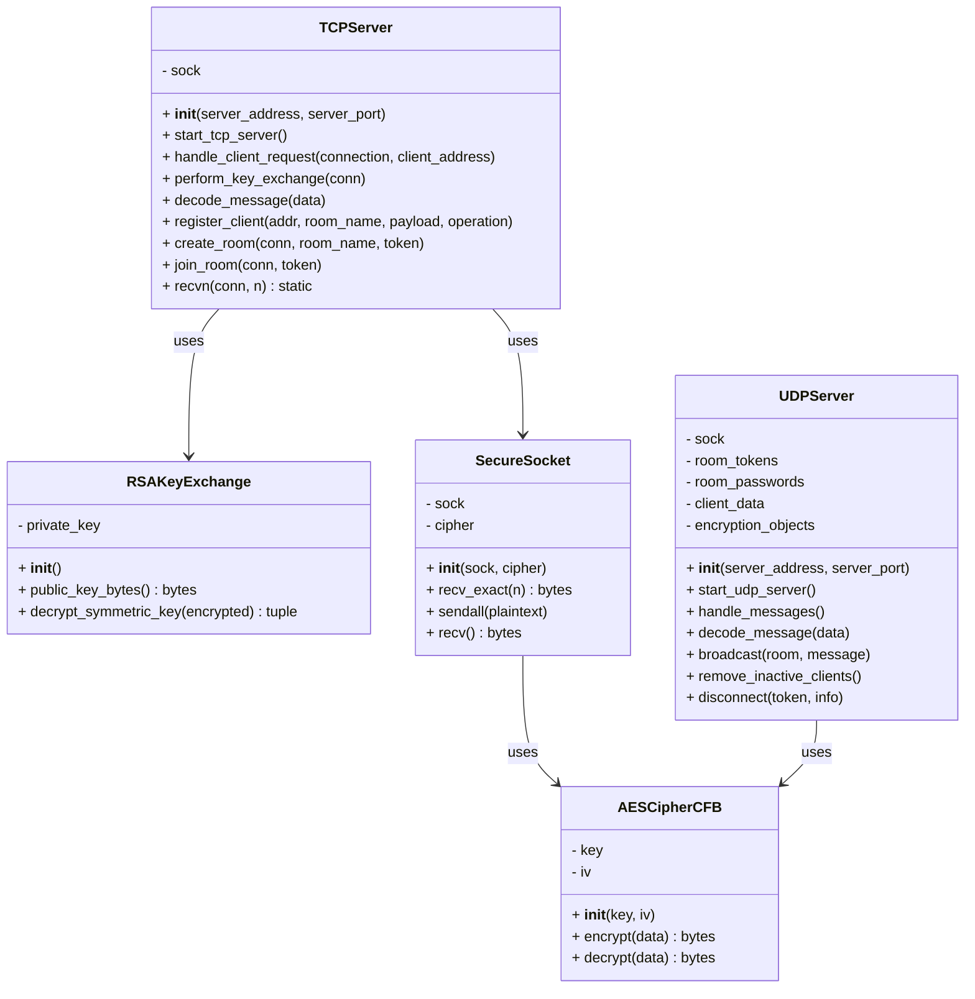
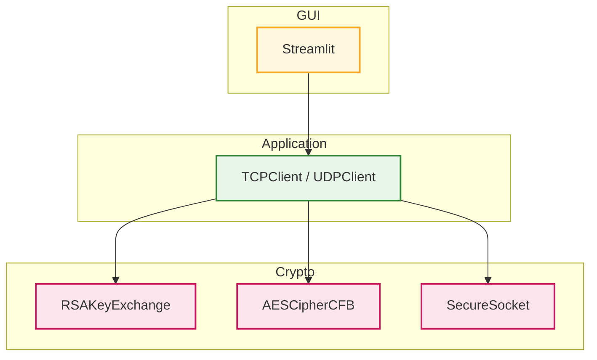

# Online Chat Service 


 


[](./LICENSE)


<br>

### 独自プロトコル・暗号通信・マルチスレッド・ソケット通信によるグループチャットアプリ

### システム設計から実装、Docker、Docker-Compose、Github Actionsの自動テストまで対応

<br>

## ⭐ デモ動画

<br>

### チャットルーム作成と会話の流れを確認できるデモ動画

<br>


  
<br>


## **📝 サービス紹介と導入ガイド**


- [サービスの特徴・開発の目的](#サービスの特徴・開発の目的)

- [セットアップ手順](#セットアップ手順)

- [基本的な使い方](#基本的な使い方)

<br>

## **🛠️ 技術構成**


- [システム全体の構成図](#システム全体の構成図)

- [使用技術](#使用技術)

- [クラス構成 と モジュール設計](#クラス構成とモジュール設計)


<br>

## **💡 開発の振り返りと展望**


- [設計上のこだわり](#設計上のこだわり)

- [苦労した点](#苦労した点)

- [クラウド化への方針](#追加予定の機能)

<br>

## **📚 出典・ライセンス**


- [参考文献](#参考文献)

- [ライセンス情報](#ライセンス情報)

<br>

---

## <a id="サービスの特徴・開発の目的"></a> 📝 サービスの特徴・開発の目的

<br>

###  サービスの全体像

- このプロジェクトは、**グループチャットができるサービス**です。

- ホストユーザがチャットルームを作成し、ゲストユーザが入室することでグループチャットができます。


<br>

###  できること

<div style="height:8px;"></div>

- **ルーム作成・参加**  

  ホストが新規ルームを作成、ゲストは既存ルームに参加

- **同時接続**
  
  マルチスレッドによって、複数のルームで複数のユーザが同時にチャット可能

- **自動退出**  

  5分間操作がないユーザーは自動的にルームから退出


<br>


###  作成のきっかけ

<div style="height:8px;"></div>

1. **課題意識**

     ライブラリに頼らずに、ネットワーク通信や暗号技術を自力で実装することで理解を深めるため

2. **解決アプローチ**

     `TCP/UDP通信`、`RSA＋AES暗号`、`独自プロトコル`、`マルチスレッド`によってチャット機能を自力で構築

3. **得られた学び**

      通信・暗号・並列処理を含むシステム設計と実装、`Docker化`、`GitHub Actions`による自動テストの経験

<br>

---

## <a id="セットアップ手順"></a> 🚀 セットアップ手順

<br>

### 1. 前提条件

以下を事前にインストールしてください

- [Git](https://git-scm.com/)

- [Docker](https://docs.docker.com/get-docker/)


  
<br>

### 2. リポジトリのクローン

以下のコマンドをターミナルで実行します

```bash
git clone git@github.com:BackendExplorer/Online-Chat-Service.git
```
```bash
cd Online-Chat-Service
```

<br>

---

## <a id="基本的な使い方"></a>🧑‍💻 基本的な使い方

<br>

### 1. コンテナ起動

Docker Desktopを起動したら、ターミナルを開いて、以下のコマンドでコンテナを起動します。


```bash
docker-compose up
```

<br>


http://localhost:8501 でアクセス可能です。

以下のように複数のクライアントを起動することで、ユーザー同士がチャットのやり取りができます

<br>

| ホスト | ゲスト |
|:-------:|:--------:|
|<br> |<br> |

<br>

### 2. ユーザーの操作手順


<br>

---


<div style="font-size:120%; line-height:1.6;">
  
## <a id="システム全体の構成図"></a>⚙️ システム全体の構成図




---


## <a id="使用技術"></a>🧰 使用技術

<br>

### 1. 技術選定の理由

- **`Python`**

  豊富な標準ライブラリと高い可読性によって、複雑なシステムを効率的に実装するため

- **`TCPソケット`**

  ルーム参加・ユーザー認証など、確実なデータ転送が必要な処理に利用するため

- **`UDPソケット`**

  チャットメッセージ送信などリアルタイム性を重視する通信に利用するため

- **`ハイブリッド暗号方式`**

  大量のクライアントがサーバに接続したとき、安全性を確保しつつ通信効率を維持するため

- **`マルチスレッド`**

  クライアントごとの並行処理を軽量に行うため

- **`Streamlit`**

  Pythonのみで手軽にWeb UIを構築できるため、開発効率を重視して採用

- **`Docker`**

  依存関係をコンテナ内に隔離し、環境差異を排除してどこでも同じ動作を保証するため

- **`Docker-Compose`**

  サーバコンテナとクライアントコンテナを同時に起動し、起動手順を簡素化するため

- **`Github Actions`**

  プッシュやプルリクエスト時に、Docker Buildxによるビルドから起動・動作確認・クリーンアップを

  自動化し、変更によって生じた不具合を素早く検出・修正できるようにするため


<br>

### 2.  技術スタックと 開発環境 の全体像

<br>

| カテゴリ       | 採用技術 と 使用ツール                                                                                     　　|
|----------------|----------------------------------------------------------------------------------------------------------------------|
| 開発言語       |  <br>標準ライブラリ使用：`socket`, `threading`, `logging`, `time`, `sys` |
| 通信技術       |   <br>独自プロトコルTCRP（Talk Chat Room Protocol）を用いた通信設計 |
| 暗号技術       |  <br>ハイブリッド暗号方式 (RSA＋AES) で通信
| 並列処理       |  <br>マルチスレッドによる並列処理                      |
| UIフレームワーク |  <br>Webベースのインターフェースを簡易に構築 |
| 開発環境       | &nbsp;&nbsp;&nbsp;&nbsp; |
| バージョン管理 | &nbsp;&nbsp;&nbsp;&nbsp; |
| インフラ |    |
| 描画ツール     | &nbsp;&nbsp;&nbsp;&nbsp; |


<br>

---

## <a id="クラス構成とモジュール設計"></a>📌 クラス構成 と モジュール設計

<br>

### <a id="server.py のクラス図"></a> [サーバプログラム](https://github.com/BackendExplorer/Online-Chat-Service/blob/main/server.py) のクラス図

<br>


<br>


### <a id="client.py のクラス図"></a> [クライアント](https://github.com/BackendExplorer/Online-Chat-Service/blob/main/client.py) のモジュール構成

<br>



 
<br>

---

## <a id="設計上のこだわり"></a>🌟 設計上のこだわり

<br>

- **プロトコル仕様**

  以下は、チャットルーム接続のために設計された
  
  独自プロトコル **TCRP（Talk Chat Room Protocol）** のパケット構造を表します。

<br>


<br>

- **課題点**

  チャットルームの作成・参加をTCP通信で制御するにあたり、  
  
  状態管理や処理の区別を正確に行う必要がありました。
  
  特に、Room作成・参加・応答といった複数の段階を整理して通信する仕組みが必要でした。

<br>

- **解決アプローチ**

  ヘッダー部に `RoomNameSize（1B）`、`Operation（1B）`、`State（1B）`、
  
  `OperationPayloadSize（29B）` を固定長で定義。
  
  その後に、RoomName（最大8バイト）と OperationPayload（最大21バイト）を送信する構成としました。
  
  各フィールドのサイズを明示することで、サーバー側での解析を簡潔にし、

  通信の一貫性と可読性を確保しました。

<br>

- **得られた成果**

  クライアントとサーバー間のチャットルーム管理が明確に区分され、
  
  状態遷移（初期要求 → 応答 → 完了）も正確に処理できるようになりました。
  
  今後のプロトコル拡張（認証追加・通知処理など）にも対応しやすい柔軟な設計となっています。

<br>


---

## <a id="苦労した点"></a> ⚠️ 苦労した点

<br>

### TCP と UDP の並列処理の設計

<br>

- **課題点**
  
  正確な通信（ルーム作成・参加など）で必要な `TCP通信` と、

  リアルタイム性が求められるチャット通信で必要な `UDP通信` を並列処理できる必要がありました。

<br>

- **解決アプローチ**

  `TCPServer` と `UDPServer` をそれぞれ別スレッドで起動し、並列処理を実現。

  クライアント情報やルーム情報は `TCPServer` のクラス変数（`room_members_map`、`clients_map`）

  に集約し、`UDPServer` からも直接参照できるように設計。
 
<br>
    
- **得られた成果**
  
  TCP による確実なルーム管理と UDP による低遅延チャットを同時に両立。
   
  複数ルーム・複数ユーザーが同時接続しても、メッセージの遅延や不整合がなく、

  安定したチャット体験を提供。  


<br>


---

## <a id="追加予定の機能"></a> 🔥 クラウド化への方針

<br>

- **課題点**

  現在はローカル環境でのみ動作しており、外部ユーザーが利用できる状態ではありません。  

  また、手動での更新は手間とミスの原因になります。

<br>

- **解決アプローチ**

  公開環境として AWS EC2 を採用し、サーバーを常時起動可能にします。
  
  GitHub Actions で Docker イメージを自動ビルド・更新し、
  
  EC2 側で自動的に pull・起動する仕組みを構築します。

<br>

- **得られる成果**

  外部公開が可能になり、実利用に近い環境での運用が実現します。
  
  自動化によって保守も簡単になり、本番展開にもつながります。
  
<br>

---

## <a id="参考文献"></a>📗 参考文献

<br>

### 公式ドキュメント

- [Python socket - ソケット通信](https://docs.python.org/3/library/socket.html)

  `TCP・UDP通信`の基本構文と使い方を参照

- [Python threading - マルチスレッド](https://docs.python.org/3/library/threading.html)

  `マルチスレッド処理`（Thread の生成・開始・join）を実装するために参照

- [PyCryptodome — RSA](https://pycryptodome.readthedocs.io/en/latest/src/cipher/oaep.html)

  `RSA公開鍵暗号`の暗号化・復号化の仕組みを理解するために参照

- [PyCryptodome — AES](https://www.pycryptodome.org/)

  `共通鍵暗号方式`によるデータの暗号化のために参照

- [Streamlit](https://docs.streamlit.io/)

  `GUI`を迅速に実装するために参照
  
<br>

### 参考にしたサイト

- [今更ながらソケット通信に入門する（Pythonによる実装例付き）](https://qiita.com/t_katsumura/items/a83431671a41d9b6358f)

- [python マルチスレッド マルチプロセス](https://qiita.com/Jungle-King/items/1d332a91647a3d996b82)

- [暗号化アルゴリズムの基本と実装をPythonで詳解](https://qiita.com/Leapcell/items/946a00fa060119f67444)

- [みんなが欲しそうなDockerテンプレートまとめ](https://qiita.com/ryome/items/ab23eeadf3c2ff6b35bd)

<br>

---

## <a id="ライセンス情報"></a>📜 ライセンス情報

<br>

<ul>
  <li>
    本プロジェクトの全コード・構成・図・UIなどの著作権は、制作者である Tenshin Noji に帰属します。<br><br>
    採用選考や個人的な学習を目的とした閲覧・参照は歓迎しますが、<br><br>
    無断転載・複製・商用利用・二次配布は禁止とさせていただきます。<br><br>
    ライセンス全文はリポジトリ内の <a href="./LICENSE.md" target="_blank">LICENSEファイル</a>をご覧ください。
  </li>
</ul>

<br>
