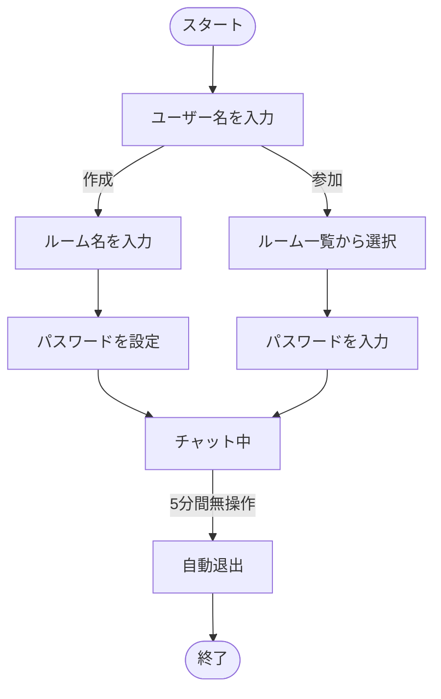
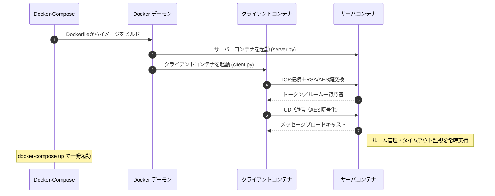
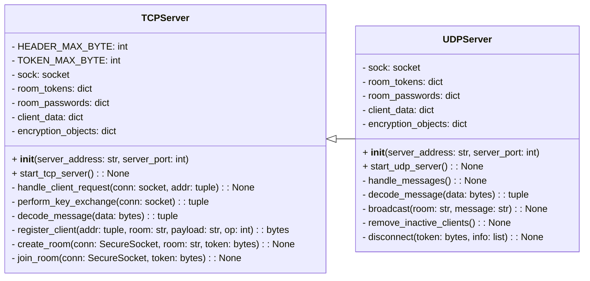
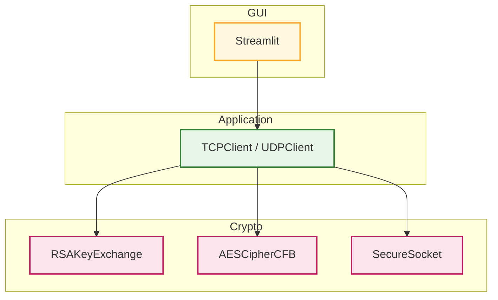
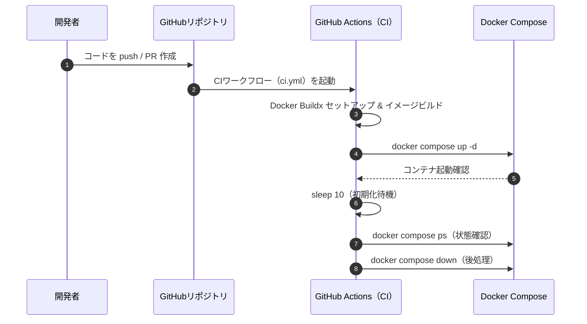

## <a id="苦労した点"></a> ⚠️ 苦労した点

<br>

### TCP と UDP の並列処理の設計

<br>

- **課題点**
  
  正確な通信（ルーム作成・参加など）で必要な `TCP通信` と、

  リアルタイム性が求められるチャット通信で必要な `UDP通信` を並列処理できる必要がありました

<br>

- **得られた成果**

  `TCPServer` と `UDPServer` をそれぞれ別スレッドで起動し、並列処理を実現。

  クライアント情報やルーム情報は `TCPServer` のクラス変数（`room_members_map`、`clients_map`）に集約し、

  `UDPServer` からも直接参照できるように設計。
 
<br>
    
- **得られた成果**
  
  TCP による確実なルーム管理と UDP による低遅延チャットを同時に両立。
   
  複数ルーム・複数ユーザーが同時接続しても、メッセージの遅延や不整合がなく、

  安定したチャット体験を提供。  


<br>


# Online Chat Service 


 


[](./LICENSE)


<br>

### 独自プロトコル・暗号通信・マルチスレッド・ソケット通信によるグループチャットアプリ

### システム設計から実装、Docker化、Github Actionsの自動テスト、Qiitaでの発信まで対応

<br>

## ⭐ デモ動画

<br>

### チャットルーム作成と会話の流れを確認できるデモ動画

<br>

https://github.com/user-attachments/assets/3923c939-72fe-4236-9f2b-3a75e9b86fcc
  
<br>


## **📝 サービス紹介と導入ガイド**


- [サービスの特徴・開発の目的](#サービスの特徴・開発の目的)

- [セットアップ手順](#セットアップ手順)

- [基本的な使い方](#基本的な使い方)

<br>

## **🛠️ 技術構成**


- [システム全体の構成図](#システム全体の構成図)

- [使用技術](#使用技術)

- [クラス構成 と アーキテクチャ](#クラス構成とアーキテクチャ)

- [GitHub Actionsによる自動テスト](#自動テストとci-cd構成)


<br>

## **💡 開発の振り返りと展望**


- [設計上のこだわり](#設計上のこだわり)

- [苦労した点](#苦労した点)

- [追加予定の機能](#追加予定の機能)

<br>

## **📚 参考情報・ライセンス**


- [Qiitaでの発信 : 開発ストーリー](#qiita-seisaku-katei-no-kaisetsu-ki)

- [参考文献](#参考文献)

- [ライセンス情報](#ライセンス情報)

<br>

---

## <a id="サービスの特徴・開発の目的"></a> 📝 サービスの特徴・開発の目的

<br>

###  サービスの全体像

- このプロジェクトは、**グループチャットができるサービス**です。

- ホストユーザがチャットルームを作成し、ゲストユーザが入室することでグループチャットができます。


<br>

###  できること

<div style="height:8px;"></div>

- **ルーム作成・参加**  

  ホストが新規ルームを作成、ゲストは既存ルームに参加

- **同時接続**
  
  マルチスレッドによって、複数のルームで複数のユーザが同時にチャット可能

- **自動退出**  

  5分間操作がないユーザーは自動的にルームから退出


<br>


###  作成のきっかけ

<div style="height:8px;"></div>

1. **課題意識**

     ライブラリに頼らずに、ネットワーク通信や暗号技術を自力で実装することで理解を深めるため

2. **解決アプローチ**

     `TCP/UDP通信`、`RSA＋AES暗号`、`独自プロトコル`、`マルチスレッド`によってチャット機能を自力で構築

3. **得られた学び**

      通信・暗号・並列処理を含むシステム設計と実装、`Docker化`、`GitHub Actions`による自動テストの経験

<br>

---

## <a id="セットアップ手順"></a> 🚀 セットアップ手順

<br>

### 1. 前提条件

以下を事前にインストールしてください

- [Python 3.8以上](https://www.python.org/downloads/)

- [PyCryptodome](https://www.pycryptodome.org/)

- [Streamlit](https://streamlit.io/)

- [Git](https://git-scm.com/)

- [Docker](https://docs.docker.com/get-docker/)


  
<br>

### 2. リポジトリのクローン

以下のコマンドをターミナルで実行します

```bash
git clone git@github.com:BackendExplorer/Online-Chat.git
```
```bash
cd Online-Chat
```

<br>

---

## <a id="基本的な使い方"></a>🧑‍💻 基本的な使い方

<br>

### 1. コンテナ起動

Docker Desktopを起動したら、ターミナルを開いて、以下のコマンドでコンテナを起動します。


```bash
docker-compose up
```

<br>


http://localhost:8501 でアクセス可能です。

以下のように複数のクライアントを起動することで、ユーザー同士がチャットのやり取りができます

<br>

| ホスト | ゲスト |
|:-------:|:--------:|
|<br> |<br> |

<br>


### 2. ユーザーの操作手順



<br>

---


<div style="font-size:120%; line-height:1.6;">
  
## <a id="システム全体の構成図"></a>⚙️ システム全体の構成図




---


## <a id="使用技術"></a>🧰 使用技術

<br>

### 1. 技術選定の理由

- **`Python`**

  豊富な標準ライブラリと高い可読性によって、複雑なシステムを効率的に実装するため

- **`TCPソケット`**

  ルーム参加・ユーザー認証など、確実なデータ転送が必要な処理に利用するため

- **`UDPソケット`**

  チャットメッセージ送信などリアルタイム性を重視する通信に利用するため

- **`ハイブリッド暗号方式`**

  大量のクライアントがサーバに接続したとき、安全性を確保しつつ通信効率を維持するため

- **`マルチスレッド`**

  クライアントごとの並行処理を軽量に行うため

- **`Streamlit`**

  Pythonのみで手軽にWeb UIを構築できるため、開発効率を重視して採用


<br>

### 2.  技術スタックと 開発環境 の全体像

<br>

| カテゴリ       | 採用技術 と 使用ツール                                                                                     　　|
|----------------|----------------------------------------------------------------------------------------------------------------------|
| 開発言語       |  <br>標準ライブラリ使用：`socket`, `threading`, `logging`, `time`, `sys` |
| 通信技術       |   <br>独自プロトコルTCRP（Talk Chat Room Protocol）を用いた通信設計 |
| 暗号技術       |  <br>ハイブリッド暗号方式 (RSA＋AES) で通信
| 並列処理       |  <br>マルチスレッドによる並列処理                      |
| UIフレームワーク |  <br>Webベースのインターフェースを簡易に構築 |
| 開発環境       | &nbsp;&nbsp;&nbsp;&nbsp; |
| バージョン管理 | &nbsp;&nbsp;&nbsp;&nbsp; |
| インフラ |    |
| 描画ツール     | &nbsp;&nbsp;&nbsp;&nbsp; |


<br>

---

## <a id="クラス構成とアーキテクチャ"></a>📌 クラス構成 と アーキテクチャ

<br>

### <a id="server.py のクラス図"></a> [サーバプログラム](https://github.com/BackendExplorer/Online-Chat-Service/blob/main/server.py) のクラス図

<br>


<br>


### <a id="client.py のクラス図"></a> [クライアント](https://github.com/BackendExplorer/Online-Chat-Service/blob/main/client.py) のアーキテクチャ図

<br>



 
<br>

## <a id="自動テストとci-cd構成"></a>🔁 GitHub Actionsによる自動テスト

<br>

<ul>
  <li>
    本プロジェクトでは GitHub Actions による CI を構築し、push/PR 時に以下を自動実行します。
    
  </li>
</ul>

<br>




<br>

---

## <a id="設計上のこだわり"></a>🌟 設計上のこだわり

<br>

<ul>
  <li>
    <p>以下は、チャットルーム接続のために設計された</p>
    <p> <strong>独自プロトコル TCRP（Talk Chat Room Protocol）</strong> のパケット構造を表します。</p>
    
  </li>
</ul>


<br><br>

---
## <a id="苦労した点"></a> ⚠️ 苦労した点

<br>

<ul>
  <li>
    <h3>TCP と UDP の並列処理の設計</h3>
    <p>正確な通信が必要な部分（ルーム作成・参加など）には <code>TCPソケット</code> を、<br>リアルタイム性が必要な部分には <code>UDP</code> を使いました。</p>
    <p>クライアントやルーム情報などは <code>TCPServer</code> のクラス変数として一元管理し、<br><code>UDPServer</code> からも参照できるようにすることで、両サーバ間で状態を正しく共有できるようにしました。</p>
  </li>
  <br>
  <li>
    <h3>非アクティブユーザーの検出と自動退出</h3>
    <p>各クライアントの最終通信時刻（<code>last_active</code>）を定期的に監視し、<br>一定時間操作がない場合は自動でルームから退出させる仕組みを実装しました。</p>
    <p>特にホストがタイムアウトした場合は、全クライアントにルーム終了の通知を送り、<br>ルーム情報も自動で削除されるようにしています。</p>
  </li>
</ul>

---

## <a id="追加予定の機能"></a> 🔥 追加予定の機能

<br>

<ul>
  
  <li>
    <h3>サーバーの EC2 デプロイ</h3>
    <p>Docker 化した <code>server.py</code> を AWS EC2 上にデプロイし、インターネット経由での利用に対応します。</p>
    <p>複数クライアントからの接続や動作確認を通じて、信頼性と安定性を検証する予定です。</p>
  </li>
</ul>

<br>


---
## <a id="qiita-seisaku-katei-no-kaisetsu-ki"></a>✏️ Qiitaでの発信 : 開発ストーリー

<br>

<ul>
  <li>
    <p>実装の背景や設計の工夫について、Qiita記事で詳しく解説しています。</p>
    <p>
      <a href="https://qiita.com/your-article-link" target="_blank" rel="noopener noreferrer">
        TCP・UDP×マルチスレッドで作る、ゼロからのチャットアプリ開発
      </a>
    </p>
  </li>
</ul>

<br>

---
## <a id="参考文献"></a>📗 参考文献

<br>

### 公式ドキュメント

- [Python socket - ソケット通信](https://docs.python.org/3/library/socket.html)

  `TCP・UDP通信`の基本構文と使い方を参照

- [Python threading - マルチスレッド](https://docs.python.org/3/library/threading.html)

  `マルチスレッド処理`（Thread の生成・開始・join）を実装するために参照

- [PyCryptodome — RSA](https://pycryptodome.readthedocs.io/en/latest/src/cipher/oaep.html)

  `RSA公開鍵暗号`の暗号化・復号化の仕組みを理解するために参照

- [PyCryptodome — AES](https://www.pycryptodome.org/)

  `共通鍵暗号方式`によるデータの暗号化のために参照

- [Streamlit](https://docs.streamlit.io/)

  `GUI`を迅速に実装するために参照
  
<br>

### 参考にしたサイト

- [今更ながらソケット通信に入門する（Pythonによる実装例付き）](https://qiita.com/t_katsumura/items/a83431671a41d9b6358f)

- [python マルチスレッド マルチプロセス](https://qiita.com/Jungle-King/items/1d332a91647a3d996b82)

- [暗号化アルゴリズムの基本と実装をPythonで詳解](https://qiita.com/Leapcell/items/946a00fa060119f67444)

- [みんなが欲しそうなDockerテンプレートまとめ](https://qiita.com/ryome/items/ab23eeadf3c2ff6b35bd)

<br>

---

## <a id="ライセンス情報"></a>📜 ライセンス情報

<br>

<ul>
  <li>
    このプロジェクトは <a href="https://opensource.org/licenses/MIT" target="_blank">MIT License</a> のもとで公開されています。<br><br>
    自由に利用、改変、再配布が可能ですが、利用の際は本ライセンス表記を保持してください。
  </li>
</ul>

<br>
