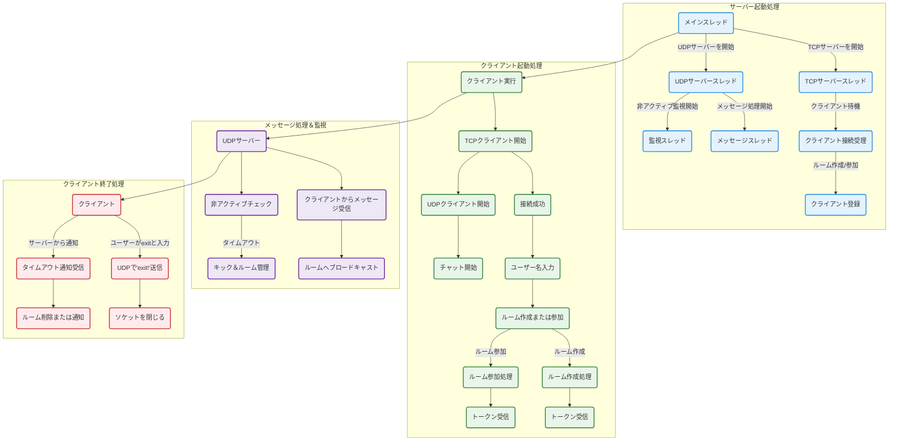
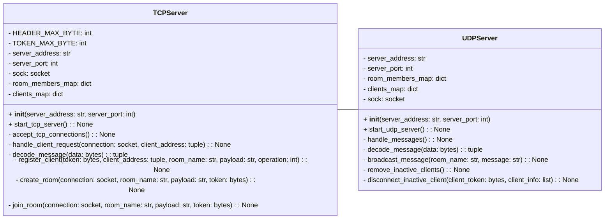
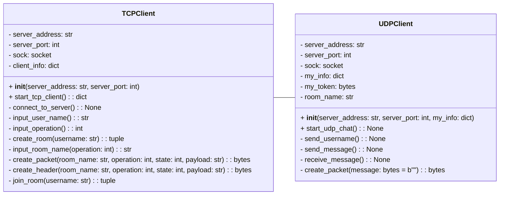

# 🌐 オンラインチャットサービス 💬  

<br>

**ユーザがルームを作成または参加して、グループチャットができるサービス**

<br>

## 🖥 デモ

https://github.com/user-attachments/assets/6127e9a1-df6e-4458-9b09-e88161da66b6

<br>

## **📝 概要**

- [説明](#説明)

- [セットアップ](#セットアップ)

- [使い方](#使い方)

<br>

## **🛠 技術関連**

- [使用技術](#使用技術)

- [クラス図](#クラス図)

- [処理の流れ](#処理の流れ)

<br>

## **💡 開発のポイント**

- [こだわりのポイント](#こだわりのポイント)

- [苦労した点](#苦労した点)

- [さらに追加したい機能](#さらに追加したい機能)

<br>

## **📚 参考情報・ライセンス**

- [Qiita｜制作過程の解説記事](#qiita-seisaku-katei-no-kaisetsu-ki)

- [参考文献](#参考文献)

- [ライセンス](#ライセンス)

<br>

---

## <a id="説明"></a> 📝 説明

このプロジェクトは、Pythonとソケット通信（TCP/UDP）を用いたリアルタイムチャットアプリケーションです。  

独自設計の通信プロトコル「TCRP」によって、効率的かつ柔軟なチャット体験を提供します。

ユーザー管理、トークン認証、ルーム機能、非アクティブ検知など実運用を想定した設計が特徴です。


###  主な特徴

- **リアルタイムチャット**

  TCPでルーム接続後、UDPで軽快なチャット通信を実現。

- **ルーム作成・参加**  

  新規作成 or 既存ルームへ参加可能。ユーザー管理はサーバーが担当。

- **セキュアな識別トークン**
  
  各クライアントにランダム生成のトークンを割り当て、識別＆管理。

- **マルチスレッド処理**  

  サーバー・クライアントともに並列処理で快適な通信を維持。

- **ログ & 自動切断**  

  操作や通信はログ出力。非アクティブユーザーは自動で切断。

<br>

---

## <a id="セットアップ"></a> 🚀 セットアップ

### 1. 前提条件

- **Python 3.8以上**  

  [Python公式サイト](https://www.python.org/downloads/) からインストールできます

- **Git**  

  [Git公式サイト](https://git-scm.com/) からインストールできます


### 2. リポジトリのクローン

以下のコマンドを使って、このプロジェクトのコードをローカルに取得します：

```bash
git clone https://github.com/yourusername/your-repo-name.git
```
```bash
cd your-repo-name
```

<br>

---

## <a id="使い方"></a>🧑‍💻 使い方

### 1. サーバ起動

サーバスクリプトを実行し、クライアントの接続を待機します。

```bash
python3 server.py
```
サーバは接続された複数のクライアントとのやりとりを同時に処理します。

### 2. クライアント起動
別のターミナルを開き、以下のコマンドでクライアントを起動します。

```bash
python3 client.py
```
複数のクライアントを起動することで、実際のチャットのようなやり取りをシミュレーションできます。

### フローチャート
以下は、このアプリの基本的な操作フローです


```mermaid
flowchart TD
    Start([スタート])
    入力[ユーザー名を入力]
    選択[作成または参加を選択]

    作成1[「作成」を選択]
    ルーム名入力[ルーム名を入力]

    参加2[「参加」を選択]
    ルーム一覧[ルーム名を選択]

    チャット中[チャット中]
    End([終了])

    Start --> 入力 --> 選択

    選択 --> 作成1 --> ルーム名入力 --> チャット中
    選択 --> 参加2 --> ルーム一覧 --> チャット中

    チャット中 --> End

```

<br>

---


## <a id="使用技術"></a>🧰 使用技術

<br>

| カテゴリ       | 技術スタック                                                                 |
|----------------|------------------------------------------------------------------------------|
| 開発言語       | Python 3.13.2<br>（標準ライブラリのみ使用：`socket`, `threading`, `secrets`, `logging`, `base64`, `time`, `sys`） |
| 通信技術       | TCP / UDP ソケット通信<br>独自プロトコル「TCRP（Talk Chat Room Protocol）」による通信設計 |
| 並列処理       | `threading` モジュールによるマルチスレッド処理<br>（クライアント・サーバー間の非同期処理を実現） |
| 開発環境       | macOS ・ VSCode                               |
| バージョン管理 | Git（バージョン管理）・GitHub（コード共有・公開）                          |
| 描画ツール | Mermaid ・ Latex |


<br>

### 技術選定の理由

- **TCP**: ルーム参加・ユーザー認証など、確実なデータ転送が必要な処理に利用

- **UDP**: チャットメッセージ送信などリアルタイム性を重視する通信に利用

- **Threading**: クライアントごとの並行処理を軽量に行うため

<br>

---

<div style="font-size:120%; line-height:1.6;">
  
## <a id="処理の流れ"></a>🔄 処理の流れ


```mermaid
graph TD

%% スタイル定義
classDef server fill:#e3f2fd,stroke:#1e88e5,stroke-width:2px
classDef client fill:#e8f5e9,stroke:#2e7d32,stroke-width:2px
classDef messaging fill:#ede7f6,stroke:#6a1b9a,stroke-width:2px
classDef warning fill:#ffebee,stroke:#c62828,stroke-width:2px

%% サーバー起動
subgraph サーバー起動[サーバー起動処理]
    A1(メインスレッド)
    A2(TCPサーバースレッド)
    A3(UDPサーバースレッド)
    A4(クライアント接続受理)
    A5(クライアント登録)
    A6(メッセージスレッド)
    A7(監視スレッド)

    A1 -->|TCPサーバーを開始| A2
    A1 -->|UDPサーバーを開始| A3
    A2 -->|クライアント待機| A4
    A4 -->|ルーム作成/参加| A5
    A3 -->|メッセージ処理開始| A6
    A3 -->|非アクティブ監視開始| A7

    class A1,A2,A3,A4,A5,A6,A7 server
end

%% クライアント起動
subgraph クライアント起動[クライアント起動処理]
    B1(クライアント実行)
    B2(TCPクライアント開始)
    B3(接続成功)
    B4(ユーザー名入力)
    B5(ルーム作成または参加)
    B6(ルーム作成処理)
    B7(トークン受信)
    B8(ルーム参加処理)
    B9(トークン受信)
    B10(UDPクライアント開始)
    B11(チャット開始)

    B1 --> B2
    B2 --> B3
    B3 --> B4
    B4 --> B5
    B5 -->|ルーム作成| B6 --> B7
    B5 -->|ルーム参加| B8 --> B9
    B2 --> B10
    B10 --> B11

    class B1,B2,B3,B4,B5,B6,B7,B8,B9,B10,B11 client
end

%% サーバーメッセージ処理
subgraph サーバーメッセージ処理[メッセージ処理＆監視]
    C1(UDPサーバー)
    C2(クライアントからメッセージ受信)
    C3(ルームへブロードキャスト)
    C4(非アクティブチェック)
    C5(キック＆ルーム管理)

    C1 --> C2 --> C3
    C1 --> C4 -->|タイムアウト| C5

    class C1,C2,C3,C4,C5 messaging
end

%% クライアント終了
subgraph クライアント終了[クライアント終了処理]
    D1(クライアント)
    D2(UDPで'exit!'送信)
    D3(ソケットを閉じる)
    D4(タイムアウト通知受信)
    D5(ルーム削除または通知)

    D1 -->|ユーザーがexitと入力| D2 --> D3
    D1 -->|サーバーから通知| D4 --> D5

    class D1,D2,D3,D4,D5 warning
end

%% 流れ接続（全体の連携）
A1 --> B1
B1 --> C1
C1 --> D1
```


</div>

<br>

---
## <a id="クラス図"></a>📦 クラス図と構成

<br>

### <a id="server.py のクラス図"></a> [サーバプログラム](https://github.com/BackendExplorer/Online-Chat-Service/blob/main/server.py) のクラス図

<br>



```mermaid
%%{init: {'themeVariables': {'scale': 0.3}}}%%
classDiagram
direction LR

TCPServer -- UDPServer

class TCPServer {
    - HEADER_MAX_BYTE: int
    - TOKEN_MAX_BYTE: int
    - server_address: str
    - server_port: int
    - sock: socket
    - room_members_map: dict
    - clients_map: dict
    + __init__(server_address: str, server_port: int)
    + start_tcp_server(): None
    - accept_tcp_connections(): None
    - handle_client_request(connection: socket, client_address: tuple): None
    - decode_message(data: bytes): tuple
    - register_client(token: bytes, client_address: tuple, room_name: str, payload: str, operation: int): None
    - create_room(connection: socket, room_name: str, payload: str, token: bytes): None
    - join_room(connection: socket, room_name: str, payload: str, token: bytes): None
}

class UDPServer {
    - server_address: str
    - server_port: int
    - room_members_map: dict
    - clients_map: dict
    - sock: socket
    + __init__(server_address: str, server_port: int)
    + start_udp_server(): None
    - handle_messages(): None
    - decode_message(data: bytes): tuple
    - broadcast_message(room_name: str, message: str): None
    - remove_inactive_clients(): None
    - disconnect_inactive_client(client_token: bytes, client_info: list): None
}
```

<br>


### <a id="client.py のクラス図"></a> [**クライアントプログラム**](https://github.com/BackendExplorer/Online-Chat-Service/blob/main/client.py) のクラス図

<br>



```mermaid
%%{init: {'themeVariables': {'scale': 0.05}}}%%
classDiagram
direction LR

TCPClient -- UDPClient

class TCPClient {
    - server_address: str
    - server_port: int
    - sock: socket
    - client_info: dict
    + __init__(server_address: str, server_port: int)
    + start_tcp_client(): dict
    - connect_to_server(): None
    - input_user_name(): str
    - input_operation(): int
    - create_room(username: str): tuple
    - input_room_name(operation: int): str
    - create_packet(room_name: str, operation: int, state: int, payload: str): bytes
    - create_header(room_name: str, operation: int, state: int, payload: str): bytes
    - join_room(username: str): tuple
}

class UDPClient {
    - server_address: str
    - server_port: int
    - sock: socket
    - my_info: dict
    - my_token: bytes
    - room_name: str
    + __init__(server_address: str, server_port: int, my_info: dict)
    + start_udp_chat(): None
    - send_username(): None
    - send_message(): None
    - receive_message(): None
    - create_packet(message: bytes = b"" ): bytes
}
```
 


<br>

---
## <a id="こだわりのポイント"></a> ✨ こだわりのポイント
この図は、チャットルーム接続のために設計された独自プロトコル TCRP（Talk Chat Room Protocol） のパケット構造を示しています。

<p align="center">
  
  
</p>

<br>

---
## <a id="苦労した点"></a> ⚠️ 苦労した点

###  1. TCPとUDPを併用した通信

#### 課題:
制御系は信頼性重視のTCP、チャットは高速なUDPで分ける必要があった

#### 対策:
`TCPServer`のクラス変数（ルーム・トークン情報）を`UDPServer`で参照し共有

#### 成果：
UDP側でも正しくメンバーを認識できるように同期を実現

<br>

---

###  2. クライアント状態の一元管理

#### 課題:
トークンでユーザーを識別しつつ、ルーム名・ユーザー名・ホスト判定・最終アクティブ時間などを管理

#### 対策：
トークンをキーにした辞書 `clients_map` に全情報を集約し、定期チェックで整合性を維持

#### 成果:
単一構造でクライアント状態を安全に管理


<br>

---

###  3. 非アクティブ検出＆自動退出

#### 課題:
一定時間操作なしのユーザーを自動で退出させ、ホスト退出時はルームごと削除

#### 対策：
`last_active_time`を監視し閾値超過で`disconnect_inactive_client`を実行。

ホスト退出時は全員へ通知後にルーム削除

#### 成果:
非アクティブ管理とルーム維持を安定化

<br>

---


## <a id="さらに追加したい機能"></a> 🌱 さらに追加したい機能

### メッセージの暗号化

- クライアントとサーバは、RSAに似た暗号化方式を使用してメッセージを保護。

- クライアントは公開鍵を生成し、サーバに送信。サーバはその公開鍵でメッセージを暗号化し送信。

- クライアントは秘密鍵でメッセージを復号化。

<br>

### パスワード保護

- チャットルーム作成時にホストがパスワードを設定可能。

- 参加時にパスワードを要求し、一致しない場合は参加不可。

<br>


---
## <a id="qiita-seisaku-katei-no-kaisetsu-ki"></a>✏️ Qiita｜制作過程の解説記事

このプロジェクトの制作過程と技術的な挑戦について、Qiitaに記事をまとめました。  

「開発の裏側」を知りたい方は、ぜひご覧ください！

- [TCP×UDP×スレッドでつくるリアルタイムチャット（設計の裏側）](https://qiita.com/your-article-link)

<br>

---
## <a id="参考文献"></a>📖 参考文献

### 公式ドキュメント

- [Python](https://docs.python.org/ja/3/)

### 参考にしたサイト

- [Pythonによるソケット通信の実装](https://qiita.com/t_katsumura/items/a83431671a41d9b6358f)

<br>

---

## <a id="ライセンス"></a>👤 ライセンス
このプロジェクトは [MIT License](https://opensource.org/licenses/MIT) のもとで公開されています。  

自由に利用、改変、再配布が可能ですが、利用の際は本ライセンス表記を保持してください。
