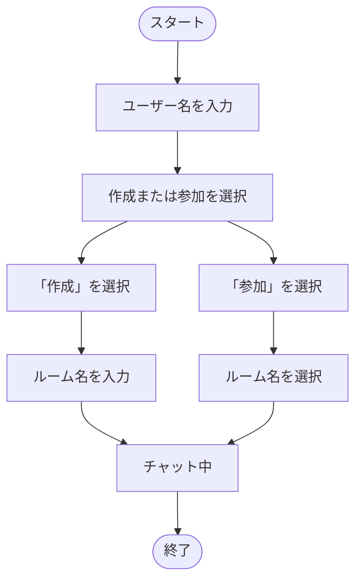
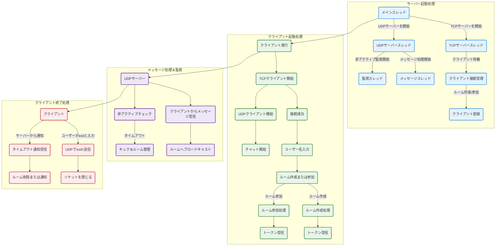
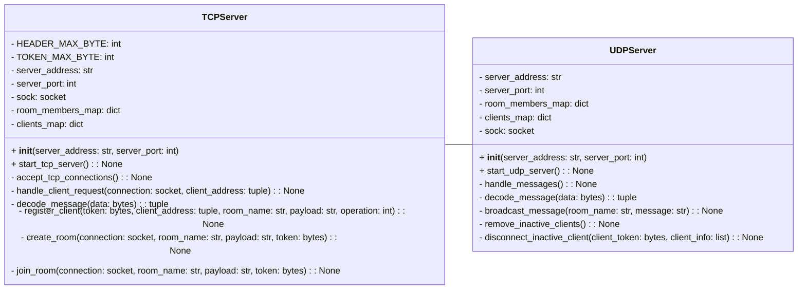
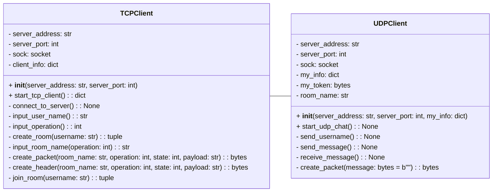

# 🌐 オンラインチャットサービス 💬  
**ユーザがルームを作成または参加して、グループチャットができるサービス**

## 🖥 デモ


---

## **📎 概要**
- [概要](#概要)
- [セットアップ](#セットアップ)
- [利用方法](#利用方法)

---

## **🛠 技術関連**
- [使用技術](#使用技術)
- [機能一覧](#機能一覧)
- [クラス図](#クラス図)
- [処理フロー (フローチャート)](#処理フロー)

---

## **📍開発のポイント**
- [こだわりのポイント](#こだわりのポイント)
- [苦労した点](#苦労した点)
- [さらに追加したい機能](#さらに追加したい機能)

---

## **📄 参考情報**
- [参考文献](#参考文献)

---


## <a id="利用方法"></a>▶️ 利用方法

### 1. クローン

```bash
git clone https://github.com/your-username/chat-app-tcp-udp.git
```

```bash
cd chat-app-tcp-udp
```

### 2. サーバ起動

```bash
python3 server.py
```


### 3. クライアント起動
```bash
python client.py
```

#### サーバのターミナル


#### クライアントのターミナル1


#### クライアントのターミナル2


## <a id="使用技術"></a>🛠 使用技術

| カテゴリ | 技術スタック |
|----------|------------|
| 開発言語 | Python 3.13.2 |
| インフラ | Docker |
| その他 | Git, GitHub |


## <a id="機能一覧"></a>⚙ 機能一覧



```mermaid
flowchart TD
    Start([スタート])
    入力[ユーザー名を入力]
    選択[作成または参加を選択]

    作成1[「作成」を選択]
    ルーム名入力[ルーム名を入力]

    参加2[「参加」を選択]
    ルーム一覧[ルーム名を選択]

    チャット中[チャット中]
    End([終了])

    Start --> 入力 --> 選択

    選択 --> 作成1 --> ルーム名入力 --> チャット中
    選択 --> 参加2 --> ルーム一覧 --> チャット中

    チャット中 --> End

```
---
<div style="font-size:120%; line-height:1.6;">

## <a id="処理フロー"></a>🔀処理フロー


```mermaid
graph TD

%% スタイル定義
classDef server fill:#e3f2fd,stroke:#1e88e5,stroke-width:2px
classDef client fill:#e8f5e9,stroke:#2e7d32,stroke-width:2px
classDef messaging fill:#ede7f6,stroke:#6a1b9a,stroke-width:2px
classDef warning fill:#ffebee,stroke:#c62828,stroke-width:2px

%% サーバー起動
subgraph サーバー起動[サーバー起動処理]
    A1(メインスレッド)
    A2(TCPサーバースレッド)
    A3(UDPサーバースレッド)
    A4(クライアント接続受理)
    A5(クライアント登録)
    A6(メッセージスレッド)
    A7(監視スレッド)

    A1 -->|TCPサーバーを開始| A2
    A1 -->|UDPサーバーを開始| A3
    A2 -->|クライアント待機| A4
    A4 -->|ルーム作成/参加| A5
    A3 -->|メッセージ処理開始| A6
    A3 -->|非アクティブ監視開始| A7

    class A1,A2,A3,A4,A5,A6,A7 server
end

%% クライアント起動
subgraph クライアント起動[クライアント起動処理]
    B1(クライアント実行)
    B2(TCPクライアント開始)
    B3(接続成功)
    B4(ユーザー名入力)
    B5(ルーム作成または参加)
    B6(ルーム作成処理)
    B7(トークン受信)
    B8(ルーム参加処理)
    B9(トークン受信)
    B10(UDPクライアント開始)
    B11(チャット開始)

    B1 --> B2
    B2 --> B3
    B3 --> B4
    B4 --> B5
    B5 -->|ルーム作成| B6 --> B7
    B5 -->|ルーム参加| B8 --> B9
    B2 --> B10
    B10 --> B11

    class B1,B2,B3,B4,B5,B6,B7,B8,B9,B10,B11 client
end

%% サーバーメッセージ処理
subgraph サーバーメッセージ処理[メッセージ処理＆監視]
    C1(UDPサーバー)
    C2(クライアントからメッセージ受信)
    C3(ルームへブロードキャスト)
    C4(非アクティブチェック)
    C5(キック＆ルーム管理)

    C1 --> C2 --> C3
    C1 --> C4 -->|タイムアウト| C5

    class C1,C2,C3,C4,C5 messaging
end

%% クライアント終了
subgraph クライアント終了[クライアント終了処理]
    D1(クライアント)
    D2(UDPで'exit!'送信)
    D3(ソケットを閉じる)
    D4(タイムアウト通知受信)
    D5(ルーム削除または通知)

    D1 -->|ユーザーがexitと入力| D2 --> D3
    D1 -->|サーバーから通知| D4 --> D5

    class D1,D2,D3,D4,D5 warning
end

%% 流れ接続（全体の連携）
A1 --> B1
B1 --> C1
C1 --> D1
```


</div>

---


## <a id="クラス図"></a>📦 クラス図と構成

このプロジェクトは、**TCP/UDP通信を用いたチャットシステム** を構成するクラス群で成り立っています。<br>
サーバーとクライアントでそれぞれの役割を持ち、以下のように分類されます。

### <a id="server.py のクラス図"></a>📍 server.py のクラス図

```mermaid
%%{init: {'themeVariables': {'scale': 0.3}}}%%
classDiagram
direction LR

TCPServer -- UDPServer

class TCPServer {
    - HEADER_MAX_BYTE: int
    - TOKEN_MAX_BYTE: int
    - server_address: str
    - server_port: int
    - sock: socket
    - room_members_map: dict
    - clients_map: dict
    + __init__(server_address: str, server_port: int)
    + start_tcp_server(): None
    - accept_tcp_connections(): None
    - handle_client_request(connection: socket, client_address: tuple): None
    - decode_message(data: bytes): tuple
    - register_client(token: bytes, client_address: tuple, room_name: str, payload: str, operation: int): None
    - create_room(connection: socket, room_name: str, payload: str, token: bytes): None
    - join_room(connection: socket, room_name: str, payload: str, token: bytes): None
}

class UDPServer {
    - server_address: str
    - server_port: int
    - room_members_map: dict
    - clients_map: dict
    - sock: socket
    + __init__(server_address: str, server_port: int)
    + start_udp_server(): None
    - handle_messages(): None
    - decode_message(data: bytes): tuple
    - broadcast_message(room_name: str, message: str): None
    - remove_inactive_clients(): None
    - disconnect_inactive_client(client_token: bytes, client_info: list): None
}
```


[▶ サーバプログラムを見る](https://github.com/BackendExplorer/Online-Chat-Service/blob/main/server.py)


### <a id="client.py のクラス図"></a>📍 client.py のクラス図

```mermaid
%%{init: {'themeVariables': {'scale': 0.05}}}%%
classDiagram
direction LR

TCPClient -- UDPClient

class TCPClient {
    - server_address: str
    - server_port: int
    - sock: socket
    - client_info: dict
    + __init__(server_address: str, server_port: int)
    + start_tcp_client(): dict
    - connect_to_server(): None
    - input_user_name(): str
    - input_operation(): int
    - create_room(username: str): tuple
    - input_room_name(operation: int): str
    - create_packet(room_name: str, operation: int, state: int, payload: str): bytes
    - create_header(room_name: str, operation: int, state: int, payload: str): bytes
    - join_room(username: str): tuple
}

class UDPClient {
    - server_address: str
    - server_port: int
    - sock: socket
    - my_info: dict
    - my_token: bytes
    - room_name: str
    + __init__(server_address: str, server_port: int, my_info: dict)
    + start_udp_chat(): None
    - send_username(): None
    - send_message(): None
    - receive_message(): None
    - create_packet(message: bytes = b"" ): bytes
}
```
[▶ クライアントプログラムを見る](https://github.com/BackendExplorer/Online-Chat-Service/blob/main/client.py)


---
## <a id="こだわりのポイント"></a> ✨ こだわりのポイント
<p align="center">
  
  
</p>


## <a id="苦労した点"></a> ⚠️ 苦労した点

## <a id="さらに追加したい機能"></a>💡 さらに追加したい機能


### 🔹　メッセージの暗号化
- クライアントとサーバは、RSAに似た暗号化方式を使用してメッセージを保護。
- クライアントは公開鍵を生成し、サーバに送信。サーバはその公開鍵でメッセージを暗号化し送信。
- クライアントは秘密鍵でメッセージを復号化。

### 🔹　パスワード保護
- チャットルーム作成時にホストがパスワードを設定可能。
- 参加時にパスワードを要求し、一致しない場合は参加不可。

### 🔹　非機能要件
- システムは毎秒最低10,000パケットの送信をサポート。
- 例えば、500ルーム、各ルーム10人が毎秒2メッセージ送信する状況を処理可能。

---


## 📄 参考文献

