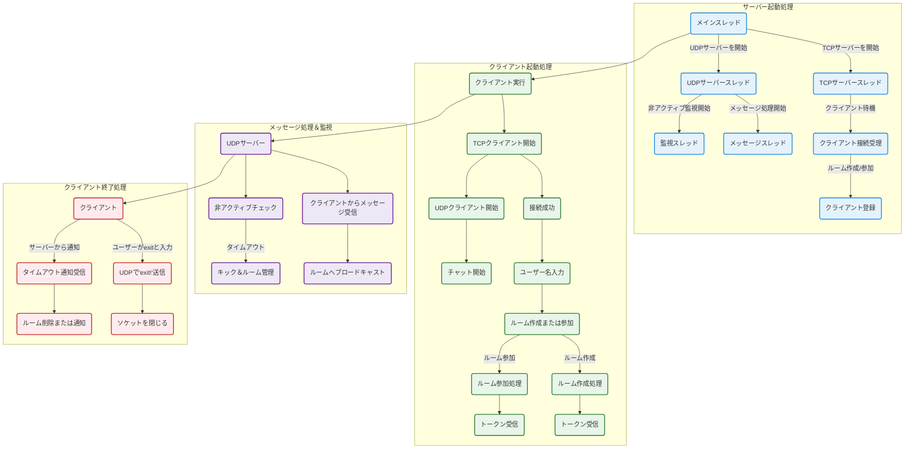
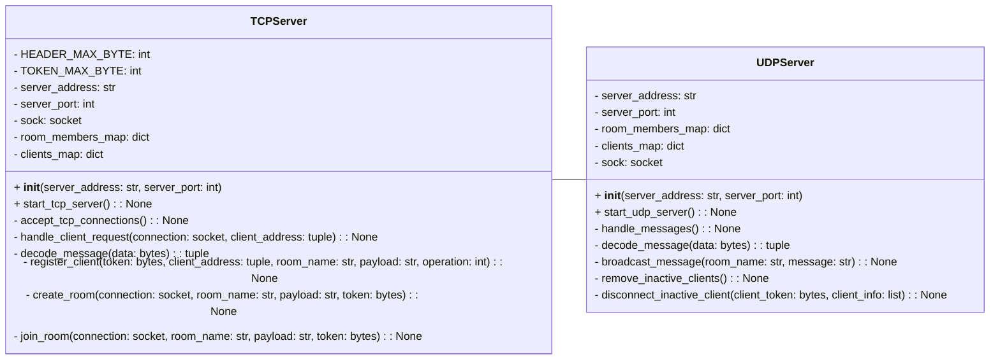
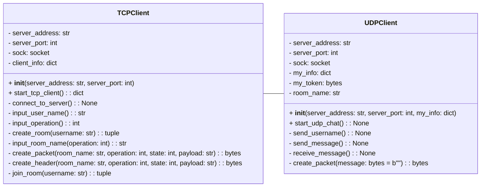

# 🌐 オンラインチャットサービス 💬  

**ユーザがルームを作成または参加して、グループチャットができるサービス**


## 🖥 デモ


## **📎 概要**
- [概要](#概要)
- [セットアップ](#セットアップ)
- [利用方法](#利用方法)

---

## **🛠 技術関連**
- [使用技術](#使用技術)
- [機能一覧](#機能一覧)
- [クラス図](#クラス図)
- [処理フロー (フローチャート)](#処理フロー)

---

## **📍開発のポイント**
- [こだわりのポイント](#こだわりのポイント)
- [苦労した点](#苦労した点)
- [さらに追加したい機能](#さらに追加したい機能)

---

## **📄 参考情報**
- [参考文献](#参考文献)

---

## 🖥 シミュレーション

## ▶️ 実行方法

## 🛠 使用技術

| カテゴリ | 技術スタック |
|----------|------------|
| 開発言語 | Python 3.13.2 |
| インフラ | Docker |
| その他 | Git, GitHub |


## ⚙ 機能一覧


## 🔀処理フロー (フローチャート)


```mermaid
graph TD

%% スタイル定義
classDef server fill:#e3f2fd,stroke:#1e88e5,stroke-width:2px
classDef client fill:#e8f5e9,stroke:#2e7d32,stroke-width:2px
classDef messaging fill:#ede7f6,stroke:#6a1b9a,stroke-width:2px
classDef warning fill:#ffebee,stroke:#c62828,stroke-width:2px

%% サーバー起動
subgraph サーバー起動[サーバー起動処理]
    A1(メインスレッド)
    A2(TCPサーバースレッド)
    A3(UDPサーバースレッド)
    A4(クライアント接続受理)
    A5(クライアント登録)
    A6(メッセージスレッド)
    A7(監視スレッド)

    A1 -->|TCPサーバーを開始| A2
    A1 -->|UDPサーバーを開始| A3
    A2 -->|クライアント待機| A4
    A4 -->|ルーム作成/参加| A5
    A3 -->|メッセージ処理開始| A6
    A3 -->|非アクティブ監視開始| A7

    class A1,A2,A3,A4,A5,A6,A7 server
end

%% クライアント起動
subgraph クライアント起動[クライアント起動処理]
    B1(クライアント実行)
    B2(TCPクライアント開始)
    B3(接続成功)
    B4(ユーザー名入力)
    B5(ルーム作成または参加)
    B6(ルーム作成処理)
    B7(トークン受信)
    B8(ルーム参加処理)
    B9(トークン受信)
    B10(UDPクライアント開始)
    B11(チャット開始)

    B1 --> B2
    B2 --> B3
    B3 --> B4
    B4 --> B5
    B5 -->|ルーム作成| B6 --> B7
    B5 -->|ルーム参加| B8 --> B9
    B2 --> B10
    B10 --> B11

    class B1,B2,B3,B4,B5,B6,B7,B8,B9,B10,B11 client
end

%% サーバーメッセージ処理
subgraph サーバーメッセージ処理[メッセージ処理＆監視]
    C1(UDPサーバー)
    C2(クライアントからメッセージ受信)
    C3(ルームへブロードキャスト)
    C4(非アクティブチェック)
    C5(キック＆ルーム管理)

    C1 --> C2 --> C3
    C1 --> C4 -->|タイムアウト| C5

    class C1,C2,C3,C4,C5 messaging
end

%% クライアント終了
subgraph クライアント終了[クライアント終了処理]
    D1(クライアント)
    D2(UDPで'exit!'送信)
    D3(ソケットを閉じる)
    D4(タイムアウト通知受信)
    D5(ルーム削除または通知)

    D1 -->|ユーザーがexitと入力| D2 --> D3
    D1 -->|サーバーから通知| D4 --> D5

    class D1,D2,D3,D4,D5 warning
end

%% 流れ接続（全体の連携）
A1 --> B1
B1 --> C1
C1 --> D1
```


## 📦 クラス図と構成


このプロジェクトは、**TCP/UDP通信を用いたチャットシステム** を構成するクラス群で成り立っています。サーバーとクライアントでそれぞれの役割を持ち、以下のように分類されます。


### 📍 server.py のクラス図

```mermaid
%%{init: {'themeVariables': {'scale': 0.3}}}%%
classDiagram
direction LR

TCPServer -- UDPServer

class TCPServer {
    - HEADER_MAX_BYTE: int
    - TOKEN_MAX_BYTE: int
    - server_address: str
    - server_port: int
    - sock: socket
    - room_members_map: dict
    - clients_map: dict
    + __init__(server_address: str, server_port: int)
    + start_tcp_server(): None
    - accept_tcp_connections(): None
    - handle_client_request(connection: socket, client_address: tuple): None
    - decode_message(data: bytes): tuple
    - register_client(token: bytes, client_address: tuple, room_name: str, payload: str, operation: int): None
    - create_room(connection: socket, room_name: str, payload: str, token: bytes): None
    - join_room(connection: socket, room_name: str, payload: str, token: bytes): None
}

class UDPServer {
    - server_address: str
    - server_port: int
    - room_members_map: dict
    - clients_map: dict
    - sock: socket
    + __init__(server_address: str, server_port: int)
    + start_udp_server(): None
    - handle_messages(): None
    - decode_message(data: bytes): tuple
    - broadcast_message(room_name: str, message: str): None
    - remove_inactive_clients(): None
    - disconnect_inactive_client(client_token: bytes, client_info: list): None
}
```

### 📍 client.py のクラス図

```mermaid
%%{init: {'themeVariables': {'scale': 0.05}}}%%
classDiagram
direction LR

TCPClient -- UDPClient

class TCPClient {
    - server_address: str
    - server_port: int
    - sock: socket
    - client_info: dict
    + __init__(server_address: str, server_port: int)
    + start_tcp_client(): dict
    - connect_to_server(): None
    - input_user_name(): str
    - input_operation(): int
    - create_room(username: str): tuple
    - input_room_name(operation: int): str
    - create_packet(room_name: str, operation: int, state: int, payload: str): bytes
    - create_header(room_name: str, operation: int, state: int, payload: str): bytes
    - join_room(username: str): tuple
}

class UDPClient {
    - server_address: str
    - server_port: int
    - sock: socket
    - my_info: dict
    - my_token: bytes
    - room_name: str
    + __init__(server_address: str, server_port: int, my_info: dict)
    + start_udp_chat(): None
    - send_username(): None
    - send_message(): None
    - receive_message(): None
    - create_packet(message: bytes = b"" ): bytes
}
```

---


### 🖥 サーバープログラム
サーバー側のクラスは、**クライアントの接続管理、リクエスト処理、ルーム管理** などを担当します。

#### 🔹 TCPServer

TCP通信を介してクライアントからのリクエストを受け取り、適切な処理を実行します。

| 機能 | 説明 |
|------|------|
| クライアントからの接続受付 | `start_tcp_server()` |
| リクエスト処理 | `handle_client_request()` |
| クライアント情報の登録 | `register_client()` |
| ルームの作成 | `create_room()` |
| ルームへの参加 | `join_room()` |
| メッセージの解析 | `decode_message()` |

#### 🔹 UDPServer

UDP通信を介してメッセージを受信し、リレーまたは適切な処理を行います。

| 機能 | 説明 |
|------|------|
| クライアントからのメッセージ受信 | `handle_messages()` |
| メッセージの処理 | `decode_message()` |
| ルーム内のメンバーにメッセージをブロードキャスト | `broadcast_message()` |
| 非アクティブクライアントの削除 | `remove_inactive_clients()` |

---

### 💻 クライアントプログラム
クライアント側のクラスは、**サーバーとの通信、メッセージ送受信、ユーザーインターフェース** を担当します。

#### 🔹 TCPClient

TCP通信を介してサーバーにリクエストを送信し、レスポンスを受信します。

| 機能 | 説明 |
|------|------|
| サーバー接続 | `connect_to_server()` |
| ルームの作成 | `create_room()` |
| ルームへの参加 | `join_room()` |
| ルーム一覧の取得 | `input_room_name()` |
| パケット作成 | `create_packet()` |

#### 🔹 UDPClient

UDP通信を介してメッセージを送受信します。

| 機能 | 説明 |
|------|------|
| ユーザー名の送信 | `send_username()` |
| メッセージの送信 | `send_message()` |
| メッセージの受信 | `receive_message()` |
| パケット作成 | `create_packet()` |

---


## ✨ こだわりのポイント

## ⚠️ 苦労した点

## 💡 さらに追加したい機能

## 📄 参考文献
<p align="center">
  
</p>


# バイト情報


---

## 詳細仕様
- **新規チャットルーム作成時**
  - 操作コードは `1`
  - 状態は `0 → 1 → 2` の順に推移
  - TCPはトランザクションの完全性を保証するために使用
  - 状態の詳細：
    1. **状態 0（サーバの初期化）**: クライアントがルーム作成リクエストを送信（希望ユーザー名を含む）
    2. **状態 1（リクエストの応答）**: サーバはステータスコードを含むペイロードで即座に応答
    3. **状態 2（リクエストの完了）**: サーバがユニークなトークンをクライアントへ送信（トークンでユーザー名を識別）

- **既存チャットルームへの参加**
  - 操作コードは `2`
  - 状態遷移はルーム作成時と同じ
  - クライアントはトークンを受け取るがホストにはならない

---

## サンプルデータ
```json
{
    "operation": 1,
    "state": 0,
    "roomName": "ChatRoom01"
}
```

---

## 文字列の扱いについて
- `RoomName` は **UTF-8** でエンコード/デコードされる
- `OperationPayload` は操作と状態に応じて異なるフォーマット（整数、文字列、JSONなど）でデコードされる可能性がある
