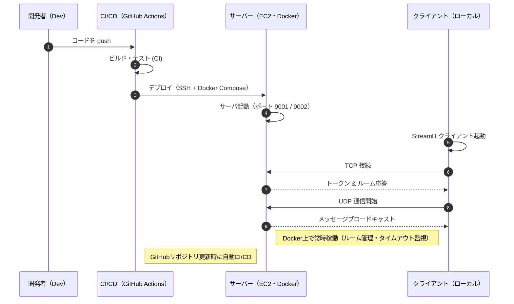
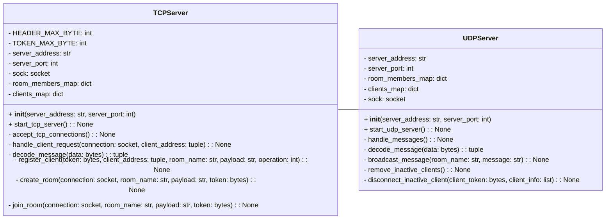
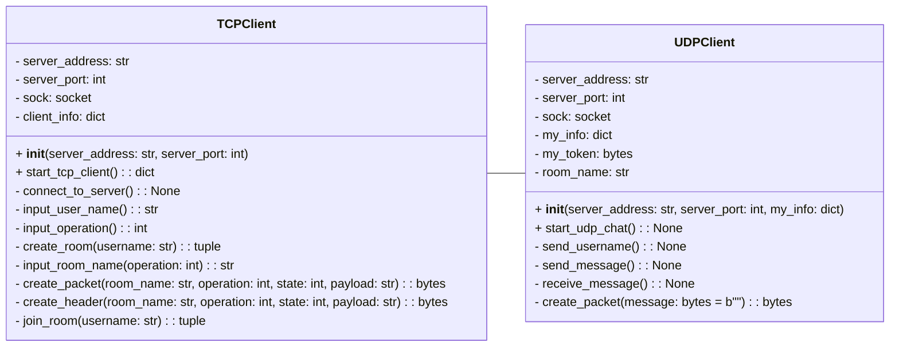

# 🌐 Online Chat Service 💬  

### TCP/UDP・独自プロトコル・マルチスレッドで構成された、グループチャットシステム

<br>

## 🖥 デモ

<br>

**2人のユーザーが、ルームを作成してチャットをするデモ動画**

<br>

https://github.com/user-attachments/assets/e810880b-abfb-4507-a21c-3f91b413be87
  
<br>


## **📝 概要**

- [説明](#説明)

- [セットアップ](#セットアップ)

- [使い方](#使い方)

<br>

## **🛠️ 技術関連**

- [使用技術](#使用技術)

- [クラス図](#クラス図)

- [アーキテクチャー図](#アーキテクチャー図)

<br>

## **💡 開発のポイント**

- [こだわりのポイント](#こだわりのポイント)

- [苦労した点](#苦労した点)

- [さらに追加したい機能](#さらに追加したい機能)

<br>

## **📚 参考情報・ライセンス**

- [開発ストーリー & Qiita 記事](#qiita-seisaku-katei-no-kaisetsu-ki)

- [参考文献](#参考文献)

- [ライセンス](#ライセンス)

<br>

---

## <a id="説明"></a> 📝 説明

<br>

このプロジェクトは、**グループチャットができるサービス**です。

ホストユーザがチャットルームを作成し、

ゲストユーザが入室することでグループチャットができます。


<br>

###  できること

- **ルーム作成・参加**  

  ホストが新規ルームを作成、ゲストは既存ルームに参加

- **同時接続**
  
  マルチスレッドによって、複数のルームで複数のユーザが同時にチャット可能

- **自動退出**  

  5分間操作がないユーザーは自動的にルームから退出


<br>

### 作成のきっかけ

`TCP・UDPソケット` や `マルチスレッド`、`独自プロトコル` の実装を通じて、

ネットワークへの理解を深めるために取り組みました。

<br>

---

## <a id="セットアップ"></a> 🚀 セットアップ

<br>

### 1. 前提条件

以下を事前にインストールしてください

- [Python 3.8以上](https://www.python.org/downloads/)

- [Git](https://git-scm.com/)

- [Streamlit 1.45.0](https://streamlit.io/)


  
<br>

### 2. リポジトリのクローン

以下のコマンドをターミナルで実行します

```bash
git clone https://github.com/yourusername/your-repo-name.git
```
```bash
cd your-repo-name
```

<br>

---

## <a id="使い方"></a>🧑‍💻 使い方

<br>

### 1. サーバー起動

ターミナルを開いて、以下のコマンドでサーバを起動します。

```bash
python3 server.py
```

<br>


### 2. クライアント起動

別のターミナルを開き、以下のコマンドでクライアントを起動します。

```bash
streamlit run gui.py
```
以下のように複数のクライアントを起動することで、ユーザー同士がチャットのやり取りができます

<br>

| ホスト | ゲスト |
|:-------:|:--------:|
|<br> |<br> |

<br>


### 3. ユーザーの操作手順


```mermaid
flowchart TD
    Start([スタート])
    入力[ユーザー名を入力]
    選択[作成または参加を選択]

    作成1[「作成」を選択]
    ルーム名入力[ルーム名を入力]

    参加2[「参加」を選択]
    ルーム一覧[ルーム名を選択]

    チャット中[チャット中]
    End([終了])

    Start --> 入力 --> 選択

    選択 --> 作成1 --> ルーム名入力 --> チャット中
    選択 --> 参加2 --> ルーム一覧 --> チャット中

    チャット中 --> End

```

<br>

---


## <a id="使用技術"></a>🧰 使用技術

<br>

### 技術選定の理由

- **`TCPソケット`**

  ルーム参加・ユーザー認証など、確実なデータ転送が必要な処理に利用

- **`UDP`**

  チャットメッセージ送信などリアルタイム性を重視する通信に利用

- **`マルチスレッド`**

  クライアントごとの並行処理を軽量に行うため

- **`Streamlit`**

  Pythonのみで手軽にWeb UIを構築できるため、開発効率を重視して採用

<br><br>


| カテゴリ       | 技術スタック                                                                                                         |
|----------------|----------------------------------------------------------------------------------------------------------------------|
| 開発言語       |  <br>標準ライブラリ使用：`socket`, `threading`, `logging`, `time`, `sys` |
| 通信技術       |   <br>独自プロトコルTCRP（Talk Chat Room Protocol）を用いた通信設計 |
| 並列処理       |  <br>マルチスレッドによる並列処理                      |
| UIフレームワーク|  <br>バージョン: 1.45.0 ／ Webアプリとして動作                     |
| 開発環境       | &nbsp;&nbsp;&nbsp;&nbsp; |
| バージョン管理 | &nbsp;&nbsp;&nbsp;&nbsp; |
| 描画ツール     | &nbsp;&nbsp;&nbsp;&nbsp; |


<br>

---

<div style="font-size:120%; line-height:1.6;">
  
## <a id="アーキテクチャー図"></a>🔄 アーキテクチャー図


```mermaid
sequenceDiagram
    autonumber
    participant Dev  as 開発者（Dev）
    participant GH   as CI/CD（GitHub Actions）
    participant EC2  as サーバー（EC2・Docker）
    participant CLI  as クライアント（ローカル）

    Dev ->> GH: コードを push
    GH ->> GH: ビルド・テスト (CI)
    GH ->> EC2: デプロイ（SSH + Docker Compose）
    EC2 ->> EC2: サーバ起動（ポート 9001 / 9002）

    CLI ->> CLI: Streamlit クライアント起動
    CLI ->> EC2: TCP 接続
    EC2 -->> CLI: トークン & ルーム応答
    CLI ->> EC2: UDP 通信開始
    EC2 -->> CLI: メッセージブロードキャスト

    note right of EC2: Docker上で常時稼働（ルーム管理・タイムアウト監視）
    note right of GH: GitHubリポジトリ更新時に自動CI/CD

```

<br>

---
## <a id="クラス図"></a>📌 クラス図

<br>

### <a id="server.py のクラス図"></a> [サーバプログラム](https://github.com/BackendExplorer/Online-Chat-Service/blob/main/server.py) のクラス図

<br>


```mermaid
%%{init: {'themeVariables': {'scale': 0.3}}}%%
classDiagram
direction LR

TCPServer -- UDPServer

class TCPServer {
    - HEADER_MAX_BYTE: int
    - TOKEN_MAX_BYTE: int
    - server_address: str
    - server_port: int
    - sock: socket
    - room_members_map: dict
    - clients_map: dict
    + __init__(server_address: str, server_port: int)
    + start_tcp_server(): None
    - accept_tcp_connections(): None
    - handle_client_request(connection: socket, client_address: tuple): None
    - decode_message(data: bytes): tuple
    - register_client(token: bytes, client_address: tuple, room_name: str, payload: str, operation: int): None
    - create_room(connection: socket, room_name: str, payload: str, token: bytes): None
    - join_room(connection: socket, room_name: str, payload: str, token: bytes): None
}

class UDPServer {
    - server_address: str
    - server_port: int
    - room_members_map: dict
    - clients_map: dict
    - sock: socket
    + __init__(server_address: str, server_port: int)
    + start_udp_server(): None
    - handle_messages(): None
    - decode_message(data: bytes): tuple
    - broadcast_message(room_name: str, message: str): None
    - remove_inactive_clients(): None
    - disconnect_inactive_client(client_token: bytes, client_info: list): None
}
```
<br>


### <a id="client.py のクラス図"></a> [クライアントプログラム](https://github.com/BackendExplorer/Online-Chat-Service/blob/main/client.py) のクラス図

<br>



```mermaid
%%{init: {'themeVariables': {'scale': 0.05}}}%%
classDiagram
direction LR

TCPClient -- UDPClient

class TCPClient {
    - server_address: str
    - server_port: int
    - sock: socket
    - client_info: dict
    + __init__(server_address: str, server_port: int)
    + start_tcp_client(): dict
    - connect_to_server(): None
    - input_user_name(): str
    - input_operation(): int
    - create_room(username: str): tuple
    - input_room_name(operation: int): str
    - create_packet(room_name: str, operation: int, state: int, payload: str): bytes
    - create_header(room_name: str, operation: int, state: int, payload: str): bytes
    - join_room(username: str): tuple
}

class UDPClient {
    - server_address: str
    - server_port: int
    - sock: socket
    - my_info: dict
    - my_token: bytes
    - room_name: str
    + __init__(server_address: str, server_port: int, my_info: dict)
    + start_udp_chat(): None
    - send_username(): None
    - send_message(): None
    - receive_message(): None
    - create_packet(message: bytes = b"" ): bytes
}
```
 
<br>

---
## <a id="こだわりのポイント"></a>⭐️ こだわりのポイント

<br>

以下は、チャットルーム接続のために設計された **独自プロトコル TCRP**（Talk Chat Room Protocol） のパケット構造を表します。

<p align="center">
  
  
</p>

<br>

---
## <a id="苦労した点"></a> ⚠️ 苦労した点

<br>

<ul>
  <li>
    <h3>TCP と UDP の並列化</h3>
    <p>制御系は信頼性重視のTCP、チャットは低遅延なUDPで分離。</p>
    <p><code>TCPServer</code>のクラス変数を<code>UDPServer</code>から参照することで、UDP側でもメンバー情報を正しく同期。</p>
  </li>
  <br>
  <li>
    <h3>アクティブでないユーザの検出 と 自動退出</h3>
    <p><code>last_active_time</code>を監視し、一定時間無操作のユーザーは自動退出。</p>
    <p>ホスト退出時は全員に通知を行い、ルーム自体を削除。</p>
  </li>
</ul>

<br>

---

## <a id="さらに追加したい機能"></a> 🔥 さらに追加したい機能

<br>

<ul>
  <li>
    <h3>メッセージの暗号化</h3>
    <p>クライアントとサーバは、RSAに似た暗号化方式を使用してメッセージを保護。</p>
    <p>クライアントは公開鍵を生成し、サーバに送信。サーバはその公開鍵でメッセージを暗号化し送信。</p>
    <p>クライアントは秘密鍵でメッセージを復号化。</p>
  </li>

  <br>
  
  <li>
    <h3>パスワード保護</h3>
    <p>チャットルーム作成時にホストがパスワードを設定可能。</p>
    <p>参加時にパスワードを要求し、一致しない場合は参加不可。</p>
  </li>
</ul>

<br>

---
## <a id="qiita-seisaku-katei-no-kaisetsu-ki"></a>✏️ 開発ストーリー & Qiita 記事

<br>

実装の背景や設計の工夫について、Qiita記事で詳しく解説しています。

[チャットアプリをゼロから設計・実装する「TCP・UDPソケットとスレッドの活用」](https://qiita.com/your-article-link)

<br>

---
## <a id="参考文献"></a>📗 参考文献

<br>

### 公式ドキュメント

- [Python](https://docs.python.org/ja/3/)

- [Streamlit](https://docs.streamlit.io)

<br>

### 参考にしたサイト

- [Pythonによるソケット通信の実装](https://qiita.com/t_katsumura/items/a83431671a41d9b6358f)

<br>

---

## <a id="ライセンス"></a>📜 ライセンス
このプロジェクトは [MIT License](https://opensource.org/licenses/MIT) のもとで公開されています。  

自由に利用、改変、再配布が可能ですが、利用の際は本ライセンス表記を保持してください。
