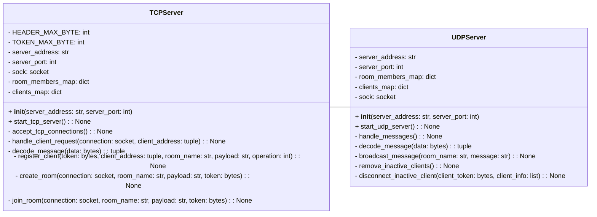

```mermaid
sequenceDiagram
    autonumber
    participant Compose as Docker-Compose
    participant Docker as Docker デーモン
    participant ClientContainer as クライアントコンテナ
    participant ServerContainer as サーバコンテナ

    %% コンテナ起動フロー
    Compose ->> Docker: Dockerfileからイメージをビルド
    Docker ->> ServerContainer: サーバーコンテナを起動 (server.py)
    Docker ->> ClientContainer: クライアントコンテナを起動 (client.py)

    %% メッセージ交換
    ClientContainer ->> ServerContainer: TCP接続＋RSA/AES鍵交換
    ServerContainer -->> ClientContainer: トークン／ルーム一覧応答
    ClientContainer ->> ServerContainer: UDP通信（AES暗号化）
    ServerContainer -->> ClientContainer: メッセージブロードキャスト

    %% クライアント内フロー (コンテナ内)
    note right of ServerContainer: ルーム管理・タイムアウト監視を常時実行
    note over Compose: docker-compose up で一発起動
    

```

```mermaid
graph TD

%% スタイル定義
classDef ui fill:#fff8e1,stroke:#f9a825,stroke-width:2px
classDef application fill:#e8f5e9,stroke:#2e7d32,stroke-width:2px
classDef infra fill:#fce4ec,stroke:#c2185b,stroke-width:2px
classDef packet fill:#e3f2fd,stroke:#1976d2,stroke-width:2px

subgraph Entry Point
  main["main.py"]
  class main ui
end

subgraph Application
  app["TCPClient / UDPClient"]
  class app application
end

subgraph Crypto
  enc["Encryption"]
  sock["EncryptedSocket"]
  class enc,sock infra
end

subgraph Input Handling
  handler["InputHandler"]
  class handler packet
end

main --> app
app  --> enc
app  --> sock
app  --> handler



```

# Online Chat Service 


 


[](./LICENSE)


<br>

### 独自プロトコル・暗号通信・マルチスレッド・ソケット通信によるグループチャットアプリ

### システム設計から実装、Docker化、Github Actionsの自動テスト、Qiitaでの発信まで対応

<br>

## ⭐ デモ動画

<br>

### チャットルーム作成と会話の流れを確認できるデモ動画

<br>

https://github.com/user-attachments/assets/3923c939-72fe-4236-9f2b-3a75e9b86fcc
  
<br>


## **📝 サービス紹介と導入ガイド**


- [サービスの特徴・開発の目的](#サービスの特徴・開発の目的)

- [セットアップ手順](#セットアップ手順)

- [基本的な使い方](#基本的な使い方)

<br>

## **🛠️ 技術構成**


- [システム全体の構成図](#システム全体の構成図)

- [使用技術](#使用技術)

- [クラス構成 と アーキテクチャ](#クラス構成とアーキテクチャ)

- [GitHub Actionsによる自動テスト](#自動テストとci-cd構成)


<br>

## **💡 開発の振り返りと展望**


- [設計上のこだわり](#設計上のこだわり)

- [苦労した点](#苦労した点)

- [追加予定の機能](#追加予定の機能)

<br>

## **📚 参考情報・ライセンス**


- [Qiitaでの発信 : 開発ストーリー](#qiita-seisaku-katei-no-kaisetsu-ki)

- [参考文献](#参考文献)

- [ライセンス情報](#ライセンス情報)

<br>

---

## <a id="サービスの特徴・開発の目的"></a> 📝 サービスの特徴・開発の目的

<br>

###  サービスの全体像

- このプロジェクトは、**グループチャットができるサービス**です。

- ホストユーザがチャットルームを作成し、ゲストユーザが入室することでグループチャットができます。


<br>

###  できること

<div style="height:8px;"></div>

- **ルーム作成・参加**  

  ホストが新規ルームを作成、ゲストは既存ルームに参加

- **同時接続**
  
  マルチスレッドによって、複数のルームで複数のユーザが同時にチャット可能

- **自動退出**  

  5分間操作がないユーザーは自動的にルームから退出


<br>


###  作成のきっかけ

<div style="height:8px;"></div>

1. **課題意識**

     ライブラリに頼らずに、ネットワーク通信や暗号技術を自力で実装することで理解を深めるため

2. **解決アプローチ**

     `TCP/UDP通信`、`RSA＋AES暗号`、`独自プロトコル`、`マルチスレッド`によってチャット機能を自力で構築

3. **得られた学び**

      通信・暗号・並列処理を含むシステム設計と実装、`Docker化`、`GitHub Actions`による自動テストの経験

<br>

---

## <a id="セットアップ手順"></a> 🚀 セットアップ手順

<br>

### 1. 前提条件

以下を事前にインストールしてください

- [Python 3.8以上](https://www.python.org/downloads/)

- [PyCryptodome](https://www.pycryptodome.org/)

- [Streamlit](https://streamlit.io/)

- [Git](https://git-scm.com/)

- [Docker](https://docs.docker.com/get-docker/)


  
<br>

### 2. リポジトリのクローン

以下のコマンドをターミナルで実行します

```bash
git clone git@github.com:BackendExplorer/Online-Chat.git
```
```bash
cd Online-Chat
```

<br>

---

## <a id="基本的な使い方"></a>🧑‍💻 基本的な使い方

<br>

### 1. コンテナ起動

Docker Desktopを起動したら、ターミナルを開いて、以下のコマンドでコンテナを起動します。


```bash
docker-compose up
```

<br>


http://localhost:8501 でアクセス可能です。

以下のように複数のクライアントを起動することで、ユーザー同士がチャットのやり取りができます

<br>

| ホスト | ゲスト |
|:-------:|:--------:|
|<br> |<br> |

<br>


### 3. ユーザーの操作手順

```mermaid
flowchart TD
%%─── ノード定義 ───
Start([スタート])
選択["ユーザー名を入力"]
ルーム名入力[ルーム名を入力]
パスワード設定[パスワードを設定]
ルーム一覧[ルーム一覧から選択]
パスワード入力[パスワードを入力]
チャット中[チャット中]
自動退出[自動退出]
End([終了])

%%─── フロー定義 ───
Start --> 選択
選択 -- 作成 --> ルーム名入力 --> パスワード設定 --> チャット中
選択 -- 参加 --> ルーム一覧 --> パスワード入力 --> チャット中
チャット中 -->|5分間無操作| 自動退出 --> End
```

<br>

---


<div style="font-size:120%; line-height:1.6;">
  
## <a id="システム全体の構成図"></a>⚙️ システム全体の構成図




---


## <a id="使用技術"></a>🧰 使用技術

<br>

### 1. 技術選定の理由

- **`Python`**

  豊富な標準ライブラリと高い可読性によって、複雑なシステムを効率的に実装するため

- **`TCPソケット`**

  ルーム参加・ユーザー認証など、確実なデータ転送が必要な処理に利用するため

- **`UDPソケット`**

  チャットメッセージ送信などリアルタイム性を重視する通信に利用するため

- **`ハイブリッド暗号方式`**

  大量のクライアントがサーバに接続したとき、安全性を確保しつつ通信効率を維持するため

- **`マルチスレッド`**

  クライアントごとの並行処理を軽量に行うため

- **`Streamlit`**

  Pythonのみで手軽にWeb UIを構築できるため、開発効率を重視して採用


<br>

### 2.  技術スタックと 開発環境 の全体像

<br>

| カテゴリ       | 採用技術 と 使用ツール                                                                                     　　|
|----------------|----------------------------------------------------------------------------------------------------------------------|
| 開発言語       |  <br>標準ライブラリ使用：`socket`, `threading`, `logging`, `time`, `sys` |
| 通信技術       |   <br>独自プロトコルTCRP（Talk Chat Room Protocol）を用いた通信設計 |
| 暗号技術       |  <br>ハイブリッド暗号方式 (RSA＋AES) で通信
| 並列処理       |  <br>マルチスレッドによる並列処理                      |
| UIフレームワーク |  <br>Webベースのインターフェースを簡易に構築 |
| 開発環境       | &nbsp;&nbsp;&nbsp;&nbsp; |
| バージョン管理 | &nbsp;&nbsp;&nbsp;&nbsp; |
| インフラ |   |
| 描画ツール     | &nbsp;&nbsp;&nbsp;&nbsp; |


<br>

---

## <a id="クラス構成とアーキテクチャ"></a>📌 クラス構成 と アーキテクチャ

<br>

### <a id="server.py のクラス図"></a> [サーバプログラム](https://github.com/BackendExplorer/Online-Chat-Service/blob/main/server.py) のクラス図

<br>


<br>


### <a id="client.py のクラス図"></a> [クライアント](https://github.com/BackendExplorer/Online-Chat-Service/blob/main/client.py) のアーキテクチャ図

<br>



 
<br>

## <a id="自動テストとci-cd構成"></a>🔁 GitHub Actionsによる自動テスト

<br>

<ul>
  <li>
    本プロジェクトでは GitHub Actions による CI を構築し、push/PR 時に以下を自動実行します。

```mermaid
sequenceDiagram
    autonumber
    participant Dev as 開発者
    participant GitHub as GitHubリポジトリ
    participant CI as GitHub Actions（CI）
    participant Compose as Docker Compose

    Dev ->> GitHub: コードを push / PR 作成
    GitHub ->> CI: CIワークフロー（ci.yml）を起動
    CI ->> CI: Docker Buildx セットアップ & イメージビルド
    CI ->> Compose: docker compose up -d
    Compose -->> CI: コンテナ起動確認
    CI ->> CI: sleep 10（初期化待機）
    CI ->> Compose: docker compose ps（状態確認）
    CI ->> Compose: docker compose down（後処理）
```
    
  </li>
</ul>

<br>




<br>

---

## <a id="設計上のこだわり"></a>🌟 設計上のこだわり

<br>

<ul>
  <li>
    <p>以下は、チャットルーム接続のために設計された</p>
    <p> <strong>独自プロトコル TCRP（Talk Chat Room Protocol）</strong> のパケット構造を表します。</p>
    
  </li>
</ul>


<br><br>

---
## <a id="苦労した点"></a> ⚠️ 苦労した点

<br>

<ul>
  <li>
    <h3>TCP と UDP の並列化</h3>
    <p>制御系は信頼性重視のTCP、チャットは低遅延なUDPで分離。</p>
    <p><code>TCPServer</code>のクラス変数を<code>UDPServer</code>から参照することで、UDP側でもメンバー情報を正しく同期。</p>
  </li>
  <br>
  <li>
    <h3>アクティブでないユーザの検出 と 自動退出</h3>
    <p><code>last_active_time</code>を監視し、一定時間無操作のユーザーは自動退出。</p>
    <p>ホスト退出時は全員に通知を行い、ルーム自体を削除。</p>
  </li>
</ul>

<br>

---

## <a id="追加予定の機能"></a> 🔥 追加予定の機能

<br>

<ul>
  
  <li>
    <h3>サーバーの EC2 デプロイ</h3>
    <p>Docker 化した <code>server.py</code> を AWS EC2 上にデプロイし、インターネット経由での利用に対応します。</p>
    <p>複数クライアントからの接続や動作確認を通じて、信頼性と安定性を検証する予定です。</p>
  </li>
</ul>

<br>


---
## <a id="qiita-seisaku-katei-no-kaisetsu-ki"></a>✏️ Qiitaでの発信 : 開発ストーリー

<br>

<ul>
  <li>
    <p>実装の背景や設計の工夫について、Qiita記事で詳しく解説しています。</p>
    <p>
      <a href="https://qiita.com/your-article-link" target="_blank" rel="noopener noreferrer">
        TCP・UDP×マルチスレッドで作る、ゼロからのチャットアプリ開発
      </a>
    </p>
  </li>
</ul>

<br>

---
## <a id="参考文献"></a>📗 参考文献

<br>

### 公式ドキュメント

- [Python socket - ソケット通信](https://docs.python.org/3/library/socket.html)

  `TCP・UDP通信`の基本構文と使い方を参照

- [Python threading - マルチスレッド](https://docs.python.org/3/library/threading.html)

  `マルチスレッド処理`（Thread の生成・開始・join）を実装するために参照

- [PyCryptodome — RSA](https://pycryptodome.readthedocs.io/en/latest/src/cipher/oaep.html)

  `RSA公開鍵暗号`の暗号化・復号化の仕組みを理解するために参照

- [PyCryptodome — AES](https://www.pycryptodome.org/)

  `共通鍵暗号方式`によるデータの暗号化のために参照

- [Streamlit](https://docs.streamlit.io/)

  `GUI`を迅速に実装するために参照
  
<br>

### 参考にしたサイト

- [今更ながらソケット通信に入門する（Pythonによる実装例付き）](https://qiita.com/t_katsumura/items/a83431671a41d9b6358f)

- [python マルチスレッド マルチプロセス](https://qiita.com/Jungle-King/items/1d332a91647a3d996b82)

- [暗号化アルゴリズムの基本と実装をPythonで詳解](https://qiita.com/Leapcell/items/946a00fa060119f67444)

- [みんなが欲しそうなDockerテンプレートまとめ](https://qiita.com/ryome/items/ab23eeadf3c2ff6b35bd)

<br>

---

## <a id="ライセンス情報"></a>📜 ライセンス情報

<br>

<ul>
  <li>
    このプロジェクトは <a href="https://opensource.org/licenses/MIT" target="_blank">MIT License</a> のもとで公開されています。<br><br>
    自由に利用、改変、再配布が可能ですが、利用の際は本ライセンス表記を保持してください。
  </li>
</ul>

<br>
